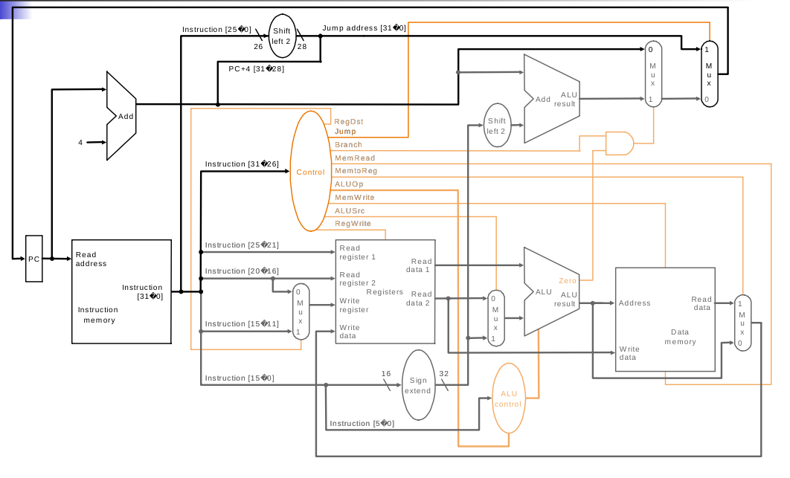

- ## Performance
	- $$\text{Performance} = \dfrac {1} {\text{Execution Time}}$$
	- $X$ is n times faster than $Y$
		- id:: 627a38dd-af50-4544-af8d-e10d28c86d27
		  $$n = \dfrac {\text{PerformanceX}} {\text{PerformanceY}} = \dfrac{\text{ExecutionTimeY}}{\text{ExecutionTimeX}}$$
		- `Example`: Time taken to run a program
		  10s on A, 
		  15s on B
		  Execution Time B / Execution Time A = 15s / 10s = 1.5 = 1½
		  So A is 1½ times faster than B
	- Performance can be improved by
		- Reducing number of clock cycles
		- Increasing clock rate
		- Hardware designer must often trade off clock rate against cycle count
	- **Base Formulas**
		- $$\text{Cpu time} = \text{CPU Clock Cycles } * \text{ Clock Cycle Time}$$
		- $$\text{Clock Cycle Time} = \dfrac{1}{\text{Clock Rate}}$$
		- $$\text{Clock Cycles} = \text{Instruction Count} * \text{Cycles per Instruction (CPI)}$$
- ## Data Path
	- **Complete Diagram**
		- 
	- **ALU Control Bits**
		- | **ALU control** | **Operation** |
		  | 000 | and |
		  | 001 | or |
		  | 010 | add |
		  | 110 | sub |
		  | 111 | slt |
		- | **Instruction** | **ALU op** | **Function Field** | **ALU Action** | **ALU Control bits** |
		  | LW / SW | 00 | xxxxxx | add | 010 |
		  | Branch (any) | 01 | xxxxxx | sub | 110 |
		  | add / sub / or / and / slt | 10 | relative function bits | add / sub / or / and / slt | *consult respective ALU Control |
	- **Control Unit Fields**
		- | **inst** | **RegDst** | **ALUsrc** | **Mem2Reg** | **RegWrite** | **MemRead** | **MemWrite** | **Branch** | **ALUop1** | **ALUop2** |
		  | R | 1 | 0 | 0 | 1 | 0 | 0 | 0 | 1 | 0 |
		  | lw | 0 | 1 | 1 | 1 | 1 | 0 | 0 | 0 | 0 |
		  | sw | x | 1 | x | 0 | 0 | 1 | 0 | 0 | 0 |
		  | beq | x | 0 | x | 0 | 0 | 0 | 1 | 0 | 1 |
- ## Hazzards
  collapsed:: true
	- There are situations in pipe-lining when the next instruction cannot execute in the following clock cycle. These events are called hazards
	- Types
		- **Structural hazards**
			- HW cannot support some combination of instructions i.e. single person to fold and put clothes away
				- Structural Hazard 1 - `Single Memory`
				  collapsed:: true
					- Read same memory twice in same clock cycle
					- Solution
						- Infeasible and inefficient to create second memory so simulate this by having two Level 1 Caches (a temporary smaller [of usually most recently used] copy of memory) Have both an L1 Instruction Cache and an L1 Data Cache Need more complex hardware to control when both caches miss.
				- Structural Hazard 2 - `Registers`
				  collapsed:: true
					- Can we read and write to registers simultaneously?
					- Solution
						- Two different solutions have been used:
							- RegFile access is VERY fast: takes less than half the time of ALU stage Write to Registers during first half of each clock cycle Read from Registers during second half of each clock cycle
							- Build RegFile with independent read and write ports
						- Result: can perform Read and Write during same clock cycle
			- Solutions
			  collapsed:: true
				- Duplicate resource
				- Pipeline the resource
				- Reorder the instructions
				- Stall if its is too expensive to eliminate a structural hazard
				- No new instruction is issued until the hazard has been resolved
		- **Control hazards**
			- Pipelining of branches causes later instruction fetches to wait for the result of the branch
			- Control hazards occur less frequently than data hazards, but there is nothing as effective against control hazards as forwarding is for data hazards
			- When the flow of instruction addresses is not sequential (i.e., PC = PC + 4); incurred by change of flow instructions
				- Conditional branches (beq, bne)
				- Unconditional branches (j, jal, jr)
				- Exceptions
			- Possible approaches
				- Stall (impacts CPI)
				- Move decision point as early in the pipeline as possible, thereby reducing the number of stall cycles
				- Delay decision (requires compiler support)
				- Predict and hope for the best
					- Static branch prediction
					- Dynamic branch prediction
						- 1bit / 2bit predictors
			- Stalls
				- Jumps not decoded until ID, so one flush is needed
				- Branches Incur Three Stalls
		- **Data hazards**
			- Instruction depends on result of prior instruction still in the pipeline
			- An instruction x is data dependent on instruction y, iff either of
				- `Direct`: Instruction x produces a result that is used by instruction y
				- `Transitive`: Instruction y is data dependent on instruction z and Instruction z is data dependent on instruction x
			- A dependence can be overcome in two different ways
				- Maintaining the dependence by avoiding a hazard
				- Eliminating a dependence by transforming the code
			- Solutions
				- Stalls
				- Data Forwarding
				- Reordering
- ## Cache Mapping
  collapsed:: true
	- ### Problem 1
		- Consider a direct-mapped Cache with 64 blocks and a block size of 16 bytes. To what block number does byte address 1200 map?
		- **Solution**
			- Step-1: 
			  You have to find the block size first. 
			  	1 block = 16 bytes
			- Step-2:
			  Then find the memory block number that byte address 1200 belongs to. 
			  Since 1 block is 16 bytes,
			  	byte address 	0 ~ 15 : block 0
			  				16 ~ 31: block 1
			  				32~ 47: block 2
			  				…
			  Therefore, 
			  	floor (byte address / block size) = memory block # 
			      So floor( 1200/16) = 75.
			- Step 3:
			  Then you need to find which cache block memory block 75 maps to.
			  In a direct-mapped cache, 
			  	cache block # = memory block # mod (total block number of cache)
			  	Therefore, 75 mod 64 = 11.
	- ### Problem 2
		- Consider a 2-way set associative cache with 64 blocks and a block size of 16 bytes. To which set number does byte address 1200 map?
		- **Solution**
			- Step 1:
			  Since the cache is 2-way set associative, a set has 2 cache blocks. Because there are 64 cache blocks, there are 32 sets in the cache (set 0 ~ set 31).
			- Step 2:
			  Byte address 1200 belongs to memory block 75. 
			  Then 
			  	set # = memory block # mod (total sets in the cache). 
			  	Therefore, 75 mod 32 = 11. 
			  So memory block 75 maps to set 11 in the cache (cache block 22 and 23) and chooses one of them. How to choose one of them is a very long story.
	- ### Problem 3
		- A 64KB cache has 16 byte blocks. If addresses are 32 bits, how many bits are used the tag, index, and offset in this cache?
		- **Solution**
			- For Direct Mapped Cache
				- Number of bits for addressing word= 4bit
				  Number of cache lines = Size of cache / size of Block
				  	64KB/16B = 4K = 12bits
				  Remaining 16 bits for tag so  division of 32 bits is like
				- | **Tag** | **Group** | **Offset** |
				  | 16 bits | 12 bits | 4 bits |
			- For 4-way set associative Cache
				- Number of bits for addressing word= 4bit
				  Number of lines/blocks in each cache set is 4 
				  so each cache set is 4*16B = 64B
				- Number of cache sets = size of cache/size of cache set 
				  64KB/64B = 1K
				- | **Tag** | **Group** | **Offset** |
				  | 18 bits | 10 bits | 4 bits |
			- For Fully Associative Cache
				- Number of index bits = 0 because any block can be stored in any line
	- ### Problem 4
		- Caches are important to providing a high-performance memory hierarchy to processors. Below is a list of 32-bit memory address reference, given as word addresses
			- 21, 166, 201, 143, 61, 166, 62, 133, 111,143, 144, 61
		- What will be the final cache contents for a Fully associative cache with one word blocks and a total size of 6 blocks?
		- Use LRU replacement. For each reference identify the index bits, the tag bits, the block offset bits, and if it is a hit or a miss
		- **Solution**
			- Caches are important to providing a high-performance memory hierarchy to processors. Below is a list of 32-bit memory address reference, given as word addresses
			  21, 166, 201, 143, 61, 166, 62, 133, 111,143, 144, 61
			- | **Cache index** | **Address in Cache** | **Hit / Miss**|
			  | 0 | 21, 62 | MM |
			  | 1 | 166, 133 | MM |
			  | 2 | 201, 111 | MM |
			  | 3 | 143 | MH |
			  | 4 | 61, 144 | MM |
			  | 5 | 166, 61 | MM |
	- ### Problem 5
		- Caches are important to providing a high-performance memory hierarchy to processors. Below is a list of 32-bit memory address reference, given as word addresses
			- 21, 166, 201, 143, 61, 166, 62, 133, 111,143, 144, 61
		- What will be the final cache contents for a Direct Mapped cache with two word blocks and a total size of 24 blocks?
		- Use LRU replacement. For each reference identify the index bits, the tag bits, the block offset bits, and if it is a hit or a miss
		- **Solution**
			- ?