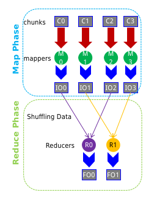
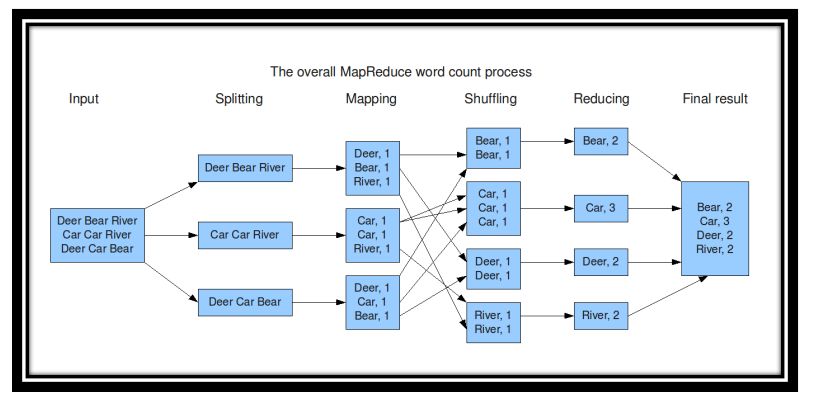
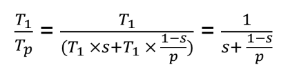
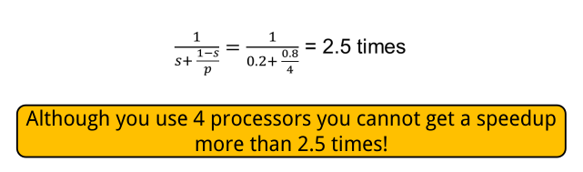

- # 1 - Introduction
  collapsed:: true
	- Big data is any data that is expensive to manage and hard to get information from:
	  collapsed:: true
		- Volume
		- Velocity
		- Variety & Complexity
	- Data Science: An area that manages, manipulates, extracts, and interprets knowledge from tremendous amount of data.
- # 2 - Offline Data Manipulation
  collapsed:: true
	- Varieties of data
		- `Structured` - data is stored, processed and manipulated in a traditional Relational Database Management System (RDBMS)
		- `Unstructured` - data that is commonly generated from human activities and doesn't fit into a structured database format
		- `Semi-Structured` - Data doesn’t fit into a structured database system, but is none-the-less structured by tags that are useful for creating a form of order and hierarchy in the data
	- Responsibilities of Data Scientist:
		- Manipulation and analysis of big data
		- Prediction from big data
		- Visualization of big data
- # 3 - Parallel Databases
  collapsed:: true
	- Architectures
		- Shared disk
		- Shared Nothing
	- Partitioning
		- Round-robin
			- Send the I th tuple inserted in the relation to disk i mod n.
		- Hash partitioning
		- Range partitioning ==imp==
			- Choose an attribute as the partitioning attribute. A partitioning vector [vo, v1, ..., vn-2]	is chosen. Let v be the partitioning attribute value of a tuple.
				- Tuples such that v <= v(i+1) go to disk I + 1.
				- Tuples with v < v(0) go to disk 0 and
				- Tuples with v >= v(n-2) go to disk n-1.
			- e.g., with a partitioning vector [5,11], a tuple with partitioning  attribute value of 2 will go to disk 0, a tuple with value 8 will  go to disk 1, while a tuple with value 20 will go to disk2.
			- Steps
				- Select Parameter
				- Sort based on parameter
				- Calculate size of partition
					- n = rows / no of partitions
				- Range Vector
	- Inter Query Parallelism
		- Queries/transactions execute in parallel with one another.
		- Increases transaction throughput
		- Easiest to implement in shared memory arch
		- Difficult in shared nothing or shared disk arch
	- Intra Query Parallelism
		- Execution of a single query in parallel on multiple processors/disks
		- Important for speeding up long-running queries
		- Two complementary forms of intraquery parallelism:
			- **Intraoperation Parallelism** – parallelize the execution of each
			  individual operation in the query.
			- **Interoperation Parallelism** – execute the different operations in
			  a query expression in parallel. (e.g., pipelining)
		-
	- Parallel Processing of Relational Operations
		- Parallel Sort
			- Range-Partitioning Sort
			- Parallel External Sort-Merge
		- Parallel Join
		- Partitioned Join
- # Map Reduce
  collapsed:: true
	- MapReduce is a programming model for data processing
	- MapReduce divides the workload into multiple independent tasks and schedule them across cluster nodes
	- In MapReduce data elements are always structured as key-value (i.e., (K, V)) pairs
	- The map and reduce functions receive and emit (K, V) pairs
	- Two fundamental pieces:
	  collapsed:: true
		- Map Step:
			- Master node takes large problem input and slices it into smaller sub-problems; distributes these to worker nodes.
			- Worker node may do this again; leads to a multi-level tree structure
			- Worker processes smaller problem and hands back to the master
		- Reduce Step
			- Master node takes the answer to the sub-problem and combines them in a predefined way to get the output/answer to original problem
	- Bird Eye's View
	  collapsed:: true
		- 
		- In MapReduce, chunks are processed in isolation by tasks called `Mappers`
		- The outputs from the mappers are denoted as intermediate outputs (IOs) and are brought into a second set of tasks called `Reducers`
		- The process of bringing together IOs into a set of Reducers is known as `shuffling process`
		- The Reducers produce the final outputs (FOs)
		- Overall, MapReduce breaks the data flow into two phases, map phase and reduce phase
	- Example
		- 
- # NoSQL
	- Stands for Not Only SQL
	- NoSQL databases is an approach to data management that is useful for very large sets of distributed data
	- A flexible database used for big data and real-time web-apps
	- A NoSQL database provides a mechanism for storage and retrieval of data that employs less constrained consistency models than traditional relational databases. Consistency is traded in favour of Availability
	- NoSQL systems are also referred to as  “NotonlySQL” to emphasize that they do not prohibit Structured Query Language (SQL), in fact allow SQL-like query languages to be used
	- Key features (advantages):
		- non-relational
		- don’t require schema
		- data are replicated to multiple nodes (so, identical & fault-tolerant) and can be partitioned:
		- down nodes easily replaced
		- no single point of failure
		- horizontal scalable
		- cheap, easy to implement (open-source)
		- massive write performance
		- fast key-value access
	- Disadvantages:
		- Don’t fully support relational features
			- no join, group by, order by operations (except within partitions)
			- no referential integrity constraints across partitions
		- No declarative query language (e.g., SQL) more programming
		- Relaxed ACID (see CAP theorem) fewer guarantees
		- No easy integration with other applications that support SQL
	- NoSQL classifications:
		- Key-Value Stores
		- Column Databases
		- Graph Database
		- Document Databases
	- Amdahl’s Law
		- How much faster will a parallel program run?
		- Suppose that the sequential execution of a program takes T1 time units and the parallel execution on p processors/machines takes Tp time units
		- Suppose that out of the entire execution of the program, `s` fraction of it is not parallelizable while `1-s` fraction is parallelizable
		- Then the speedup (Amdahl’s formula):
			- 
		- Example
			- Suppose that:
				- 80% of your program can be parallelized
				- 4 machines are used to run your parallel version of the program
			- The speedup you can get according to Amdahl’s law is:
			- 
- # Statistical Models
	- $$ \text{Variance}(x) = \frac{\sum_{i=1}^{n}(x_i-\bar{X})^2}{N} $$
	- $$ \text{Cov}(x, y) = \frac{\sum^{n}_{i=1}(x_i-\bar{X})(y_i-\bar{Y})}{n-1} $$
	- $r$ is a Pearson’s Correlation Coefficient or standardized covariance (unitless)
	- $$ r=\frac{\text{cov}(x,y)}{\sqrt{\text{var}(x)\text{var}(y)}} = \frac{\sum^{n}_{i=1}(x_i-\bar{X})(y_i-\bar{Y})}{\sqrt{\sum_{i=1}^{n}(x_i-\bar{X})^2\sum_{i=1}^{n}(y_i-\bar{Y})^2}} $$
	- Linear Regression
		- $$ y=\alpha + \beta x $$
		- $$ \alpha = \frac{(\sum y)(\sum x^2)- (\sum x)(\sum xy))}{n(\sum x^2)-(\sum x)^2} $$
		- $$ \beta = \frac{n(\sum xy)- (\sum x)(\sum y)}{n(\sum x^2)-(\sum x)^2} $$
- # Entropy
	- Formula
	- $$ E(D) = - \sum_{i=1}^C Pr(C_i) \log_2Pr(C_i)  $$
-