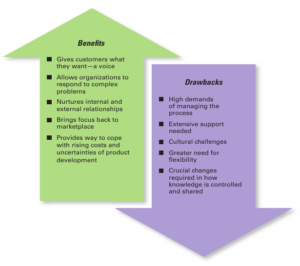

- # Chapter 1 - Managers and You in the Workplace
  collapsed:: true
	- Manager
	  collapsed:: true
		- Someone who coordinates and oversees the work of other people so organizational goals can be accomplished
		- Classification
		  collapsed:: true
			- first-line (frontline) managers
			  collapsed:: true
				- Managers at the lowest level of management who manage the work of nonmanagerial employees
			- middle managers
			  collapsed:: true
				- Managers between the lowest level and top levels of the organization who manage the work of first-line managers
			- top managers
			  collapsed:: true
				- Managers at or near the upper levels of the organization structure who are responsible for making organization-wide decisions and establishing the goals and plans that affect the entire organization
		- Importance
		  collapsed:: true
			- Inspire you professionally and personally
			- Energize you and your coworkers to accomplish things together that you couldn’t
			  get done by yourself
			- Provide coaching and guidance with problems
			- Provide you feedback on how you’re doing
			- Help you to improve your performance
			- Keep you informed of organizational changes
			- Change your life
	- Organization
	  collapsed:: true
		- A deliberate arrangement of people to accomplish some specific purpose
	- Management
	  collapsed:: true
		- Coordinating and overseeing the work activities of others so their activities are completed efficiently and effectively
	- Efficiency
	  collapsed:: true
		- Doing things right, or getting the most output from the least amount of inputs
	- Effectiveness
	  collapsed:: true
		- Doing the right things, or doing those work activities that will result in achieving goals
	- Management Functions
	  collapsed:: true
		- Planning
		  collapsed:: true
			- Management function that involves setting goals, establishing strategies for achieving those goals, and developing plans to integrate and coordinate activities
		- Organizing
		  collapsed:: true
			- Management function that involves arranging and structuring work to accomplish the organization’s goals
		- Leading
		  collapsed:: true
			- Management function that involves working with and through people to accomplish organizational goals
		- Controlling
		  collapsed:: true
			- Management function that involves monitoring, comparing, and correcting work performance
	- Mintzberg’s Managerial Roles and a Contemporary Model of Managing
	  collapsed:: true
		- Henry Mintzberg, a well-known management researcher, studied actual managers at work. In his first comprehensive study, Mintzberg concluded that what managers do can best be described by looking at the managerial roles they engage in at work.
		  collapsed:: true
		  `Managerial role` - Specific actions or behaviors expected of and exhibited by a manager
			- Interpersonal roles
			  collapsed:: true
				- Managerial roles that involve people and other duties that are ceremonial and symbolic in nature
			- Informational roles
			  collapsed:: true
				- Managerial roles that involve collecting, receiving, and disseminating information
			- Decisional roles
			  collapsed:: true
				- Managerial roles that revolve around making choices
	- Management Skills
	  collapsed:: true
		- Robert L. Katz proposed that managers need three critical skills in managing: technical, human, and conceptual.
		- Technical skills
		  collapsed:: true
			- Job-specific knowledge and techniques needed to proficiently perform work tasks
		- Interpersonal skills
		  collapsed:: true
			- The ability to work well with other people individually and in a group
		- Conceptual skills
		  collapsed:: true
			- The ability to think and to conceptualize about abstract and complex situations
		- 
	- HOW is the manager’s job changing?
	  collapsed:: true
		- Focus on the Customer
		- Focus on Technology
		- Focus on Social Media
		- Focus on Innovation
		- Focus on Sustainability
		- Focus on the Employee
	- WHY study management?
	  collapsed:: true
		- The Universality of Management
		- The Reality of Work
		- Rewards and Challenges of Being a Manager
		  collapsed:: true
			- | Reward | Challenges |
			  | Create a work environment in which organizational members can work to the best of their ability | Do hard work |
			  | Have opportunities to think creatively and use imagination | May have duties that are more clerical than managerial |
			  | Help others find meaning and fulfillment in work | Have to deal with a variety of personalities |
			  | Support, coach, and nurture others | Often have to make do with limited resources |
			  | Work with a variety of people | Motivate workers in chaotic and uncertain situations |
			  | Receive recognition and status in organization and community | Blend knowledge, skills, ambitions, and experiences of a diverse work group |
			  | Play a role in influencing organizational outcomes | Success depends on others’ work performance |
			  | Receive appropriate compensation in the form of salaries, bonuses, and stock options | |
			  | Good managers are needed by organizations | |
		- Gaining Insights into Life at Work
	- History Module
	  collapsed:: true
		- 
		- EARLY Management
		  collapsed:: true
			- Organized endeavors directed by people responsible for planning, organizing, leading, and controlling activities have existed for thousands of years.
		- CLASSICAL Approach
		  collapsed:: true
			- These first studies of management, often called the classical approach
			- `Scientific Management`: the use of scientific methods to define the “one best way” for a job to be done.
			  collapsed:: true
				- Taylor’s Scientific Management Principles
				  collapsed:: true
					- Develop a science for each element of an individual’s work to replace the old rule-of-thumb method.
					- Scientifically select and then train, teach, and develop the worker.
					- Heartily cooperate with the workers to ensure that all work is done in accordance with the principles of the science that has been developed.
					- Divide work and responsibility almost equally between management and workers. Management does all work for which it is better suited than the workers.
			- `General Administrative`: An approach to management that focuses on describing what managers do and what constitutes good management practice
			  collapsed:: true
				- Fayol’s 14 Principles of Management
				  collapsed:: true
					- `Division of work`. Specialization increases output by making employees more efficient.
					- `Authority`. Managers must be able to give orders, and authority gives them this right.
					- `Discipline`. Employees must obey and respect the rules that govern the organization.
					- `Unity of command`. Every employee should receive orders from only one superior.
					- `Unity of direction`. The organization should have a single plan of action to guide managers and workers.
					- `Subordination of individual interests to the general interest`. The interests of any one employee or group of employees should not take precedence over the interests of the organization as a whole.
					- `Remuneration`. Workers must be paid a fair wage for their services.
					- `Centralization`. This term refers to the degree to which subordinates are involved in decision making.
					- `Scalar chain`. The line of authority from top management to the lowest ranks is the scalar chain.
					- `Order`. People and materials should be in the right place at the right time.
					- `Equity`. Managers should be kind and fair to their subordinates.
					- `Stability of tenure of personnel`. Management should provide orderly personnel planning and ensure that replacements are available to fill vacancies.
					- `Initiative`. Employees allowed to originate and carry out plans will exert high levels of effort.
					- `Esprit de corps`. Promoting team spirit will build harmony and unity within the organization.
				- `bureaucracy` - A form of organization characterized by division of labor, a clearly defined hierarchy, detailed rules and regulations, and impersonal relationships
		- BEHAVIORAL Approach
		  collapsed:: true
			- `organizational behavior (OB)` - The study of the actions of people at work
			- Hawthorne Studies
			  collapsed:: true
				- A series of studies during the 1920s and 1930s that provided new insights into individual and group behavior
		- QUANTITATIVE Approach
		  collapsed:: true
			- The use of quantitative techniques to improve decision making
			- `total quality management (TQM)` - A philosophy of management that is driven by continuous improvement and responsiveness to customer needs and expectations
			- What Is Quality Management?
			  collapsed:: true
				- `Intense focus on the customer` . The customer includes outsiders who buy the organization’s products or services and internal customers who interact with and serve others in the organization.
				- `Concern for continual improvement`. Quality management is a commitment to never being satisfied. “Very good” is not good enough. Quality can always be improved.
				- `Process focused`. Quality management focuses on work processes as the quality of goods and services is continually improved.
				- `Improvement in the quality of everything the organization does`. This relates to the final product, how the organization handles deliveries, how rapidly it responds to complaints, how politely the phones are answered, and the like.
				- `Accurate measurement`. Quality management uses statistical techniques to measure every critical variable in the organization’s operations. These are compared against standards to identify problems, trace them to their roots, and eliminate their causes.
				- `Empowerment of employees`. Quality management involves the people on the line in the improvement process. Teams are widely used in quality management programs as empowerment vehicles for finding and solving problems.
		- CONTEMPORARY Approaches
		  collapsed:: true
			- Systems Approach
			  collapsed:: true
				- `system` - A set of interrelated and interdependent parts arranged in a manner that produces a unified whole
				- `closed systems` - Systems that are not influenced by and do not interact with their environment
				- `open systems` -  Systems that interact with their environment
			- Contingency Approach
			  collapsed:: true
				- A management approach that recognizes organizations as different, which means they face different situations and require different ways of managing
				- Popular Contingency Variables
				  collapsed:: true
					- `Organization Size`. As size increases, so do the problems of coordination. For instance, the type of organization structure appropriate for an organization of 50,000 employees is likely to be inefficient for an organization of 50 employees.
					- `Routineness of Task Technology`. To achieve its purpose, an organization uses technology. Routine technologies require organizational structures, leadership styles, and control systems that differ from those required by customized or nonroutine technologies.
					- `Environmental Uncertainty`. The degree of uncertainty caused by environmental changes influences the management process. What works best in a stable and predictable environment may be totally inappropriate in a rapidly changing and unpredictable environment.
					- `Individual Differences`. Individuals differ in terms of their desire for growth, autonomy, tolerance of ambiguity, and expectations. These and other individual differences are particularly important when managers select motivation techniques, leadership styles, and job designs.
- # Chapter 8 - Planning and Goal-Setting
  collapsed:: true
	- What Is Planning?
	  collapsed:: true
		- Management function that involves setting goals, establishing strategies for achieving those goals, and developing plans to integrate and coordinate work activities
		- Why Do Managers Plan?
		  collapsed:: true
			- 1. Planning provides direction to managers and non-managers alike
			  2. Planning reduces uncertainty
			  3. Planning minimizes waste and redundancy
			  4. Planning establishes the goals or standards
		- Planning and Performance
		  collapsed:: true
			- formal planning is associated with positive financial results—higher profits, higher return on assets, and so forth. Second, it seems that doing a good job planning and implementing those plans play a bigger part in high performance than how much planning is done.
	- Goals and plans
	  collapsed:: true
		- `goals` - Desired outcomes or targets
		- `plans` - Documents that outline how goals are going to be met
		- Types of Goals
		  collapsed:: true
			- `Stated goals` - Official statements of what an organization says, and what it wants its various stakeholders to believe, its goals are
			- `Real goals` - Goals that an organization actually pursues, as defined by the actions of its members
		- Types of Plans
		  collapsed:: true
			- `Strategic plans` - Plans that apply to the entire organization and establish the organization’s overall goals
			- `Operational plans` - Plans that encompass a particular operational area of the organization
			- `long-term plans` - Plans with a time frame beyond three years
			- `Short-term plans` - Plans covering one year or less
			- `specific plans` - Plans that are clearly defined and leave no room for interpretation
			- `directional plans` - Plans that are flexible and set out general guidelines
			- `single-use plan` - A one-time plan specifically designed to meet the needs of a unique situation
			- `standing plans` - Ongoing plans that provide guidance for activities performed repeatedly
		- Approaches to Setting Goals
		  collapsed:: true
			- Traditional goal setting
			  collapsed:: true
				- An approach to setting goals in which top managers set goals that then flow down through the organization and become subgoals for each organizational area
			- `means-ends chain` - An integrated network of goals in which the accomplishment of goals at one level serves as the means for achieving the goals, or ends, at the next level.
			- Management by Objectives (MBO)
			  collapsed:: true
				- A process of setting mutually agreed upon goals and using those goals to evaluate employee performance
				- Steps
				  collapsed:: true
					- The organization’s overall objectives and strategies are formulated.
					- Major objectives are allocated among divisional and departmental units.
					- Unit managers collaboratively set specific objectives for their units with their managers.
					- Specific objectives are collaboratively set with all department members.
					- Action plans, defining how objectives are to be achieved, are specified and agreed upon by managers and employees.
					- The action plans are implemented.
					- Progress toward objectives is periodically reviewed, and feedback is provided.
					- Successful achievement of objectives is reinforced by performance-based rewards.
		- Characteristics of well-written goals
		  collapsed:: true
			- Goals aren’t all written the same way. Some are better than others at making the desired outcomes clear. For instance, in 2009 Samsung Electronics announced specific lofty goals in its written plan titled “Vision 2020.” By 2020, it plans to achieve $400 billion in sales, becoming first in the global IT industry, and growing into a top 10 global company.
			- Well-Written Goals
			  collapsed:: true
				- Written in terms of outcomes rather than actions
				- Measurable and quantifiable
				- Clear as to a time frame
				- Challenging yet attainable
				- Written down
				- Communicated to all necessary organizational members
		- Steps in Goal setting
		  collapsed:: true
			- Review the organization’s mission, or purpose.
			  collapsed:: true
				- `Mission` - The purpose of an organization
			- Evaluate available resources.
			- Determine the goals individually or with input from others
			- Write down the goals and communicate them to all who need to know
			- Review results and whether goals are being met
	- Developing Plans
	  collapsed:: true
		- The process of developing plans is influenced by three contingency factors and by the planning approach followed.
		- Three contingency factors affect the choice of plans
		  collapsed:: true
			- Organizational level
			  collapsed:: true
				- Upper level : Strategic Planning
				- Lower level : Operational Planning
			- Degree of environmental uncertainty
			  collapsed:: true
				- uncertainty : Specific but flexible plans
			- Length of future commitments. (time frame)
		- Commitment concept
		  collapsed:: true
			- Plans should extend far enough to meet those commitments made when the plans were developed
		- Approaches to Planning
		  collapsed:: true
			- Traditional approach using Formal planning department
			  collapsed:: true
				- A group of planning specialists whose sole responsibility is helping to write organizational plans
			- Another approach to planning is to involve more organizational members in the process. In this approach, plans aren’t handed down from one level to the next, but instead are developed by organizational members at the various levels and in the various work units to meet their specific needs
	- Contemporary issues in planning
	  collapsed:: true
		- How Can Managers Plan Effectively in Dynamic Environments?
		  collapsed:: true
			- Flatten hierarchy is better in dynamic environment.
			- Persistent Planning improves performance.
			- Specific but flexible planning.
		- How Can Managers Use Environmental Scanning?
		  collapsed:: true
			- `Environmental Screening` - scanning information to detect trends
			- `Competitor intelligence` - Gathering information about competitors that allows managers to anticipate competitors’ actions rather than merely react to them
			- Digital Tools
			  collapsed:: true
				- Technology, systems, or software that allow the user to collect, visualize, understand, or analyze data
				- Provides: `business intelligence` - data that managers can use to make more effective strategic decisions
				- `DATA VISUALIZATION TOOLS`
				- `cloud computing` - Refers to storing and accessing data on the Internet rather than on a computer’s hard drive or a company’s network.
				- `INTERNET OF THINGS` - Allows everyday “things” to generate and store and share data across the Internet
- # Chapter 9 - Strategic Planning
  collapsed:: true
	- What Is Strategic Management?
	  collapsed:: true
		- What managers do to develop the organization’s strategies
	- strategies
	  collapsed:: true
		- The plans for how the organization will do what it’s in business to do, how it will compete successfully, and how it will attract and satisfy its customers in order to achieve its goals
	- business model - How a company is going to make money
	- Why Is Strategic Management Important?
	  collapsed:: true
		- The most significant one is that it can make a difference in how well an organization performs.
		- Another reason it’s important has to do with the fact that managers in organizations of all types and sizes face continually changing situations
		- strategic management is important because organizations are complex and diverse. Each part needs to work together toward achieving the organization’s goals; strategic management helps do this
	- Strategic Management Process
	  collapsed:: true
		- 
		- A six-step process that encompasses strategic planning, implementation, and evaluation
		- Step 1: Identifying the Organization’s Current Mission, Goals, and Strategies
		  collapsed:: true
			- What should a mission statement include?
			  collapsed:: true
				- | Customers | Who are the firm’s customers? |
				  | Markets | Where does the firm compete geographically? |
				  | Concern for survival, growth, and profitability stability? | Is the firm committed to growth and financial |
				  | Philosophy | What are the firm’s basic beliefs, values, and ethical priorities? |
				  | Concern for public image | How responsive is the firm to societal and environmental concerns? |
				  | Products or services | What are the firm’s major products or services? |
				  | Technology | Is the firm technologically current? |
				  | Self-concept| What are the firm’s major competitive advantage and core competencies? |
				  | Concern for employees | Are employees a valuable asset of the firm? |
		- Step 2: Doing an External Analysis
		  collapsed:: true
			- `Environmental Scanning` - Once they’ve analyzed the environment, managers need to pinpoint opportunities that the organization can exploit and threats that it must counteract or buffer against.
			- `opportunities` - Positive trends in the external environment
			- `threats` - Negative trends in the external environment
			- What impact might the following trends have for businesses?
			  collapsed:: true
				- With the passage of the national health care legislation, every big restaurant chain
				  must now post calorie information on their menus and drive-through signs.
				- Cell phones are now used by customers more for data transmittal and retrieval
				  than for phone calls and the number of smartphones and tablet computers
				  continues to soar.
				- The unemployment rate has been declining.
				- More young adults are earning college degrees according to data released from the U.S. Department of Education.
		- Step 3: Doing an Internal Analysis
		  collapsed:: true
			- `capabilities` - An organization’s skills and abilities in doing the work activities needed in its business
			- `core competencies` - The organization’s major value creating capabilities that determine its competitive weapons
			- `strengths` - Any activities the organization does well or its unique resources
			- `weaknesses` - Activities the organization does not do well or resources it needs but does not possess
		- SWOT analysis
		  collapsed:: true
			- An analysis of the organization’s strengths, weaknesses, opportunities, and threats
			- The combined external and internal analyses are called the SWOT analysis
		- Step 4: Formulating Strategies
		  collapsed:: true
			- As managers formulate strategies, they should consider the realities of the external environment and their available resources and capabilities in order to design strategies that will help an organization achieve its goals.
		- Step 5: Implementing Strategies
		  collapsed:: true
			- No matter how effectively an organization has planned its strategies, performance will suffer if the strategies aren’t implemented properly.
		- Step 6: Evaluating Results
		  collapsed:: true
			- How effective have the strategies been at helping the organization reach its goals? What adjustments are necessary?
	- Types of Strategies
	  collapsed:: true
		- Corporate strategies
		  collapsed:: true
			- Top level managers
			- An organizational strategy that determines what businesses a company is in or wants to be in, and what it wants to do with those businesses
			- types
			  collapsed:: true
				- `growth strategy` - A corporate strategy that’s used when an organization wants to expand the number of markets served or products offered, either through its current business(es) or through new business(es)
				- `stability strategy` - A corporate strategy in which an organization continues to do what it is currently doing
				- `renewal strategy` - A corporate strategy designed to address declining performance
			- BCG matrix
			  collapsed:: true
				- A strategy tool that guides resource allocation decisions on the basis of market share and growth rate of SBUs
				- An organization’s various businesses could be evaluated and plotted using a 2 × 2 matrix to identify which ones offered high potential and which were a drain on organizational resources. The horizontal axis represents market share (low or high), and the vertical axis indicates anticipated market growth (low or high).
				- A business unit is evaluated using a SWOT analysis and placed in one of
				  collapsed:: true
				  the four categories, which are as follows:
					- `Stars`: High market share/High anticipated growth rate
					- `Cash Cows`: High market share/Low anticipated growth rate
					- `Question Marks`: Low market share/High anticipated growth rate
					- `Dogs`: Low market share/Low anticipated growth rate
		- Competitive strategies
		  collapsed:: true
			- Mid level managers
			- An organizational strategy for how an organization will compete in its business(es)
			- strategic business unit (SBU)
			  collapsed:: true
				- The single independent businesses of an organization that formulate their own competitive strategies
			- competitive advantage - What sets an organization apart; its distinctive edge
			  collapsed:: true
				- QUALITY AS A COMPETITIVE ADVANTAGE
				- DESIGN THINKING AS A COMPETITIVE ADVANTAGE
				- SOCIAL MEDIA AS A COMPETITIVE ADVANTAGE
				- SUSTAINING COMPETITIVE ADVANTAGE
			- FIVE FORCES MODEL
			  collapsed:: true
				- five competitive forces dictate the rules of competition. Together, these five forces determine industry attractiveness and profitability, which managers assess using these five factors
				  collapsed:: true
					- 1. **Threat of new entrants**. How likely is it that new competitors will come into the industry?
					  2. **Threat of substitutes**. How likely is it that other industries’ products can be substituted for our industry’s products?
					  3. **Bargaining power of buyers**. How much bargaining power do buyers (customers) have?
					  4. **Bargaining power of suppliers**. How much bargaining power do suppliers have?
					  5. **Current rivalry**. How intense is the rivalry among current industry competitors?
		- Functional strategies
		  collapsed:: true
			- front line managers
			- A strategy used by an organization’s various functional departments to support the competitive strategy
	- Choosing a Competitive Strategy `Porter`
	  collapsed:: true
		- According to Porter, no firm can be successful by trying to be all things to all people. He proposed that managers select a strategy that will give the organization a competitive advantage, either from having lower costs than all other industry competitors or by being significantly different from competitors.
		- `Cost leadership strategy` - When an organization competes on the basis of having the lowest costs (costs or expenses, not prices) in its industry, it’s following a cost leadership strategy.
		- `Differentiation strategy` - A company that competes by offering unique products that are widely valued by customers is following a differentiation strategy
		- `Focus strategy` - involves a cost advantage (cost focus) or a differentiation advantage (differentiation focus) in a narrow segment or niche.
		- What happens if an organization can’t develop a cost or a differentiation advantage? Porter called that being `stuck in the middle`
	- Current strategic management issues
	  collapsed:: true
		- The Need for Strategic Leadership
		  collapsed:: true
			- Strategic Leadership - The ability to anticipate, envision, maintain flexibility, think strategically, and work with others in the organization to initiate changes that will create a viable and valuable future for the organization
			- 
		- The Need for Strategic Flexibility
		  collapsed:: true
			- `Strategic flexibility` - The ability to recognize major external changes, to quickly commit resources, and to recognize when a strategic decision was a mistake
			- Developing Strategic Flexibility
			  collapsed:: true
				- Encourage leadership unity by making sure everyone is on the same page.
				- Keep resources fluid and move them as circumstances warrant.
				- Have the right mindset to explore and understand issues and challenges.
				- Know what’s happening with strategies currently being used by monitoring and measuring results.
				- Encourage employees to be open about disclosing and sharing negative information.
				- Get new ideas and perspectives from outside the organization.
				- Have multiple alternatives when making strategic decisions.
				- Learn from mistakes.
	- Important Organizational Strategies for Today’s Environment
	  collapsed:: true
		- E-BUSINESS STRATEGIES
		- CUSTOMER SERVICE STRATEGIES
		- INNOVATION STRATEGIES
		  collapsed:: true
			- `first mover` - An organization that’s first to bring a product innovation to the market or to use a new process innovation
			- 
		-
- # Chapter 11 - Organization Design
  collapsed:: true
	- Organizing
	  collapsed:: true
		- Management function that involves arranging and structuring work to accomplish the organization’s goals
		- Purposes of Organizing
		  collapsed:: true
			- Divides work to be done into specific jobs and departments.
			- Assigns tasks and responsibilities associated with individual jobs.
			- Coordinates diverse organizational tasks.
			- Clusters jobs into units.
			- Establishes relationships among individuals, groups, and departments.
			- Establishes formal lines of authority.
			- Allocates and deploys organizational resources.
	- `Organizational structure` - The formal arrangement of jobs within an organization
	- `Organizational chart` - The visual representation of an organization’s structure
	- `Organizational design` - Creating or changing an organization’s structure
	- SIX elements of organizational design
	  collapsed:: true
		- Work Specialization
		  collapsed:: true
			- Dividing work activities into separate job tasks
		- Departmentalization
		  collapsed:: true
			- The basis by which jobs are grouped together
			- Types
			  collapsed:: true
				- FUNCTIONAL DEPARTMENTALIZATION —Groups Jobs According to Function
				- GEOGRAPHICAL DEPARTMENTALIZATION—Groups Jobs According to Geographic Region
				- PRODUCT DEPARTMENTALIZATION—Groups Jobs by Product Line
				- PROCESS DEPARTMENTALIZATION—Groups Jobs on the Basis of Product or Customer Flow
				- CUSTOMER DEPARTMENTALIZATION—Groups Jobs on the Basis of Specific and Unique Customers Who Have Common Needs
			- `cross-functional team` - A work team composed of individuals from various functional specialties
		- Chain of Command
		  collapsed:: true
			- The line of authority extending from upper organizational levels to the lowest levels, which clarifies who reports to whom
			- `authority` - The rights inherent in a managerial position to tell people what to do and to expect them to do it
			- `line authority` - Authority that entitles a manager to direct the work of an employee
			- `staff authority` - Positions with some authority that have been created to support, assist, and advise those holding line authority
			- `responsibility` - The obligation or expectation to perform any assigned duties
			- `unity of command` - The management principle that each person should report to only one manager
			- TODAY's View
			  collapsed:: true
				- it is less important as information can be spread easily now a days.
		- Span of Control
		  collapsed:: true
			- The number of employees a manager can efficiently and effectively manage
			- TODAY’S VIEW
			  collapsed:: true
				- The trend in recent years has been toward larger spans of control, which is consistent with managers’ efforts to speed up decision making, increase flexibility, get closer to customers, empower employees, and reduce costs
		- Centralization and Decentralization
		  collapsed:: true
			- `Centralization` - The degree to which decision making is concentrated at upper levels of the organization
			- `decentralization` - The degree to which lower-level employees provide input or actually make decisions
			- Early management writers proposed that the degree of centralization in an organization depended on the situation. Their goal was the optimum and efficient use of employees. Traditional organizations were structured in a pyramid, with power and authority concentrated near the top of the organization
			- TODAY’S VIEW
			  collapsed:: true
				- As organizations have become more flexible and responsive to environmental trends, there’s been a distinct shift toward decentralized decision making. This trend, also known as employee empowerment, gives employees more authority (power) to make decisions.
			- | **More Centralization** | **More Decentralization** |
			  | Environment is stable. | Environment is complex, uncertain. |
			  | Lower-level managers are not as capable or experienced at making decisions as upper-level managers. | Lower-level managers are capable and experienced at making decisions. |
			  | Lower-level managers do not want a say in decisions. | Lower-level managers want a voice in decisions. |
			  | Decisions are relatively minor. | Decisions are significant. |
			  | Organization is facing a crisis or the risk of company failure.  | Corporate culture is open to allowing managers a say in what happens. |
			  | Company is large. | Company is geographically dispersed. | 
			  | Effective implementation of company strategies depends on managers retaining say over what happens. | Effective implementation of company strategies depends on managers having involvement and flexibility to make decisions. |
		- Formalization
		  collapsed:: true
			- How standardized an organization’s jobs are and the extent to which employee behavior is guided by rules and procedures
			- TODAY’S VIEW
			  collapsed:: true
				- Considering there are numerous situations where rules may be too restrictive, many organizations have allowed employees some latitude, giving them sufficient autonomy to make those decisions that they feel are best under the circumstances
	- MECHANISTIC and organic structures
	  collapsed:: true
		- `Mechanistic organization` - An organizational design that’s rigid and tightly controlled
		- `Organic organization` - An organizational design that’s highly adaptive and flexible
		- 
	- CONTINGENCY factors affecting structural choice
	  collapsed:: true
		- Strategy and Structure
		  collapsed:: true
			- The flexibility and free-flowing information of the organic structure works well when an organization is pursuing meaningful and unique innovations. The mechanistic organization with its efficiency, stability, and tight controls works best for companies wanting to tightly control costs.
		- Size and Structure
		  collapsed:: true
			- once there are around 2,000 employees, it’s already fairly mechanistic. Adding another 500 employees won’t impact the structure much. On the other hand, adding 500 employees to an organization with only 300 employees is likely to make it more mechanistic.
		- Technology and Structure
		  collapsed:: true
			- That organizations adapt their structures to their technology depending on how routine their technology is for transforming inputs into outputs.
			- `unit production` - The production of items in units or small batches
			- `mass production` - The production of items in large batches
			- `process production` - The production of items in continuous processes
			- 
		- Environmental Uncertainty and Structure
		  collapsed:: true
			- In stable and simple environments, mechanistic designs can be more effective.
			- Greater the uncertainty, the more an organization needs the flexibility of an organic design.
	- TRADITIONAL organizational design options
	  collapsed:: true
		- `Simple Structure` - An organizational design with little departmentalization, wide spans of control, centralized authority, and little formalization
		- `Functional Structure` - An organizational design that groups together similar or related occupational specialties
		- `Divisional Structure` - An organizational structure made up of separate, semiautonomous units or divisions
		- 
	- ORGANIZING for flexibility in the twenty-first century
	  collapsed:: true
		- `Team structure` -  An organizational structure in which the entire organization is made up of work teams
		  collapsed:: true
			- In this structure, employee empowerment is crucial because no line of managerial authority flows from top to bottom.
			- Google found that its best teams share five traits
			  collapsed:: true
				- psychological safety
				- dependability
				- structure and clarity
				- meaningful membership
				- purpose.
		- Matrix and Project Structures
		  collapsed:: true
			- `matrix structure` - An organizational structure that assigns specialists from different functional departments to work on one or more projects
			- `project structure` - An organizational structure in which employees continuously work on projects
		- The Boundaryless Organization
		  collapsed:: true
			- An organization whose design is not defined by, or limited to, the horizontal, vertical, or external boundaries imposed by a predefined structure
			- VIRTUAL ORGANIZATIONS
			  collapsed:: true
				- An organization that consists of a small core of full-time employees and outside specialists temporarily hired as needed to work on projects
			- TASK FORCES
			  collapsed:: true
				- A temporary committee or team formed to tackle a specific short-term problem affecting several departments
				- Open innovation
				  collapsed:: true
					- Opening up the search for new ideas beyond the organization’s boundaries and allowing innovations to easily transfer inward and outward
					- 
		- Telecommuting
		  collapsed:: true
			- A work arrangement in which employees work at home and are linked to the workplace by computer
		- Compressed Workweeks, Flextime, and Job Sharing
		  collapsed:: true
			- `compressed workweek` - A workweek where employees work longer hours per day but fewer days per week
			- `flextime (or flexible work hours)` - A scheduling system in which employees are required to work a specific number of hours a week but are free to vary those hours within certain limits
			- `job sharing` - The practice of having two or more people split a full-time job
		- The Contingent Workforce
		  collapsed:: true
			- Around the world, many organizations are coping with labor shortages and peak work demands by hiring employees on a temporary or part-time basis.
			- `contingent workers` - Temporary, freelance, or contract workers whose employment is contingent on demand for their services
- # Chapter 12 - Organizing Around Teams
  collapsed:: true
	- Developing Your Coaching Skills
		- Know the goal
		  collapsed:: true
			- One of the characteristics of an effective team, as you’ll see in this chapter, is having clear goals. Teams that are able to achieve high levels of performance have a clear understanding of the goals to be achieved. Team members will be committed to the team’s goals, know what they’re expected to accomplish, and understand how they need to work together to achieve these goals.
		- Know your team
		  collapsed:: true
			- Just as important as having clear goals and knowing the goals is knowing the skills, abilities, and motivations of each team member. An effective coach knows what each team member brings to the team and where each person might contribute most effectively.
		- Build a relationship of mutual trust
		  collapsed:: true
			- The foundation of an excellent team-coach relationship is mutual trust. Again, you’ll see this discussed in the chapter as one of the characteristics of an effective team. Without mutual trust, a coach won’t be able to be honest in guiding the team and in giving feedback and team members won’t be open to receiving the feedback and being guided.
		- Provide feedback
		  collapsed:: true
			- Effective coaches recognize and understand the value and importance of giving continual performance feedback—both positive and corrective—to their team. Anyone who has played a sport knows that a good coach constantly gives feedback so that you can get better at it. If you want your team to be effective, team members need to know where they stand and where they need to “step up their game.” (See Chapter 18’s It’s Your Career for advice on how to be effective at giving feedback.)
		- Create an atmosphere of accountability.
		  collapsed:: true
			- In a team environment where work is done collectively, it’s important that team members and the coach are accountable to each other and to the team. What does it mean to be accountable? Be responsible. Follow through on commitments to each other. Don’t make excuses. Don’t whine. Don’t point fingers at each other. That’s what it  means to be accountable. And it’s important!
	- Examples of Formal Work Groups
		- `Command groups` — Groups determined by the organizational chart and composed of individuals who report directly to a given manager.
		- `Task groups` — Groups composed of individuals brought together to complete a specific job task; their existence is often temporary because when the task is completed, the group disbands.
		- `Cross-functional teams` — Groups that bring together the knowledge and skills of individuals from various work areas or groups whose members have been trained to do each others’ jobs.
		- `Self-managed teams` — Groups that are essentially independent and that, in addition to their own tasks, take on traditional managerial responsibilities such as hiring, planning and scheduling, and evaluating performance.
	- `Group` - Two or more interacting and interdependent individuals who come together to achieve specific goals
	- Stages of Group Development
		- forming stage
		  collapsed:: true
			- The first stage of group development in which people join the group and then define the group’s purpose, structure, and leadership
		- storming stage
		  collapsed:: true
			- The second stage of group development, characterized by intragroup conflict
		- norming stage
		  collapsed:: true
			- The third stage of group development, characterized by close relationships and cohesiveness performing stage The fourth stage of group development when the group is fully functional and works on group task
		- adjourning
		  collapsed:: true
			- The final stage of group development for temporary groups during which group members are concerned with wrapping up activities rather than task performance
	- Group Structure
		- ROLES
		  collapsed:: true
			- Behavior patterns expected of someone occupying a given position in a social unit
		- NORMS
		  collapsed:: true
			- Standards or expectations that are accepted and shared by a group’s members
		- CONFORMITY
		  collapsed:: true
			- `groupthink` - When a group exerts extensive pressure on an individual to align his or her opinion with others’ opinions
			  id:: 62c2b811-f575-4499-820d-61a2c9abf304
		- STATUS SYSTEMS
		  collapsed:: true
			- `status` - A prestige grading, position, or rank within a group
		- GROUP SIZE
		  collapsed:: true
			- `social loafing` - The tendency for individuals to expend less effort when working collectively than when working individually
		- GROUP COHESIVENESS
		  collapsed:: true
			- The degree to which group members are attracted to one another and share the group’s goals
	- Group Processes
		- Determines group performance and satisfaction concerns the processes that go on within a work group such as communication, decision making, conflict management, and the like. These processes are important to understanding work groups because they influence group performance and satisfaction positively or negatively.
		- GROUP DECISION MAKING
		- CONFLICT MANAGEMENT
		  collapsed:: true
			- `conflict` - Perceived incompatible differences that result in interference or opposition
			- `traditional view of conflict` - The view that all conflict is bad and must be avoided
			- `human relations view of conflict` - The view that conflict is a natural and inevitable outcome in any group
			- `interactionist view of conflict` - The view that some conflict is necessary for a group to perform effectively
			- `functional conflicts` - Conflicts that support a group’s goals and improve its performance
			- `dysfunctional conflicts` - Conflicts that prevent a group from achieving its goals
			- `task conflict` - Conflicts over content and goals of the work
			- `relationship conflict` - Conflict based on interpersonal relationships
			- `process conflict` - Conflict over how work gets done
	- Group Tasks
	- The Difference Between Groups and Teams
		- `work teams` - Groups whose members work intensely on a specific, common goal using their positive synergy, individual and mutual accountability, and complementary skills
		- | **Work Teams** | **Work Groups** |
		  | Leadership role is shared | One leader clearly in charge |
		  | Accountable to self and team | Accountable only to self |
		  | Team creates specific purpose | Purpose is same as broader organizational purpose |
		  | Work is done collectively | Work is done individually |
		  | Meetings characterized by open-ended discussion and collaborative problem-solving | Meetings characterized by efficiency; no collaboration or open-ended discussion |
		  | Performance is measured directly by evaluating collective work output | Performance is measured indirectly according to its influence on others |
		  | Work is decided upon and done together | Work is decided upon by group leader and delegated to individual group members |
		  | Can be quickly assembled, deployed, refocused, and disbanded | - |
	- Types of Work Teams
		- problem-solving team
		  collapsed:: true
			- A team from the same department or functional area that’s involved in efforts to improve work activities or to solve specific problems
		- self-managed work team
		  collapsed:: true
			- A type of work team that operates without a manager and is responsible for a complete work process or segment
		- cross-functional team
		  collapsed:: true
			- A work team composed of individuals from various functional specialties
		- virtual team
		  collapsed:: true
			- A type of work team that uses technology to link physically dispersed members in order to achieve a common goal
	- Creating Effective Work Teams
		- CLEAR GOALS
		  collapsed:: true
			- High-performance teams have a clear understanding of the goal to be achieved. Members are committed to the team’s goals, know what they’re expected to accomplish, and understand how they will work together to achieve these goals.
		- RELEVANT SKILLS
		  collapsed:: true
			- Effective teams are composed of competent individuals who have the necessary technical and interpersonal skills to achieve the desired goals while working well together. This last point is important because not everyone who is technically competent has the interpersonal skills to work well as a team member.
		- MUTUAL TRUST
		  collapsed:: true
			- Effective teams are characterized by high mutual trust among members. That is, members believe in each other’s ability, character, and integrity. But as you probably know from personal relationships, trust is fragile. Maintaining this trust requires careful attention by managers.
		- UNIFIED COMMITMENT
		  collapsed:: true
			- Unified commitment is characterized by dedication to the team’s goals and a willingness to expend extraordinary amounts of energy to achieve them. Members of an effective team exhibit intense loyalty and dedication to the team and are willing to do whatever it takes to help their team succeed.
		- GOOD COMMUNICATION
		  collapsed:: true
			- Not surprisingly, effective teams are characterized by good communication. Members convey messages, verbally and nonverbally, between each other in ways that are readily and clearly understood. Also, feedback helps guide team members and correct misunderstandings. Like a couple who has been together for many years, members of high-performing teams are able to quickly and efficiently share ideas and feelings.
		- NEGOTIATING SKILLS
		  collapsed:: true
			- Effective teams are continually making adjustments to who does what. This flexibility requires team members to possess negotiating skills. Because problems and relationships regularly change within teams, members need to be able to confront and reconcile differences.
		- APPROPRIATE LEADERSHIP
		  collapsed:: true
			- Effective leaders are important. They can motivate a team to follow them through the most difficult situations. How? By clarifying goals, demonstrating that change is possible by overcoming inertia, increasing the self confidence of team members, and helping members to more fully realize their potential. Increasingly, effective team leaders act as coaches and facilitators. They help guide and support the team, but don’t control it. Studies have shown that when a team leader’s emotional displays—positive and negative—are used at appropriate times, the team’s functioning and performance can be enhanced
		- INTERNAL AND EXTERNAL SUPPORT
		  collapsed:: true
			- The final condition necessary for an effective team is a supportive climate. Internally, the team should have a sound infrastructure, which means proper training, a clear and reasonable measurement system that team members can use to evaluate their overall performance, an incentive program that recognizes and rewards team activities, and a supportive human resource system. The right infrastructure should support members and reinforce behaviors that lead to high levels of performance. Externally, managers should provide the team with the resources needed to get the job done.
	- Managing Global Teams
		- Two characteristics of today’s organizations are obvious: They’re global, and work
		  is increasingly done by teams. These two aspects mean that any manager is likely to
		  have to manage a global team.
		- GROUP MEMBER RESOURCES IN GLOBAL TEAMS
		  collapsed:: true
			- In global organizations, understanding the relationship between group performance and group member resources is more challenging because of the unique cultural characteristics represented by members of a global team. In addition to recognizing team members’ abilities, skills, knowledge, and personality, managers need to be familiar with and clearly understand the cultural characteristics of the groups and the group members they manage.
		- GROUP STRUCTURE
		  collapsed:: true
			- Some of the structural areas where we see differences in managing global teams include conformity, status, social loafing, and cohesiveness.
		- GROUP PROCESSES
		  collapsed:: true
			- The processes global teams use to do their work can be particularly challenging for managers. For one thing, communication issues often arise because not all team members may be fluent in the team’s working language. This can lead to inaccuracies, misunderstandings, and inefficiencies.
			- However, research also has shown that a multicultural global team is better able to capitalize on the diversity of ideas represented if a wide range of information is used.
		- MANAGER’S ROLE
		  collapsed:: true
			- Despite the challenges associated with managing global teams, managers can provide the group with an environment in which efficiency and effectiveness are enhanced
			- First, because communication skills are vital, managers should focus on developing those skills. Also, as we’ve said earlier, managers must consider cultural differences when deciding what type of global team to use
			- Finally, it’s vital that managers be sensitive to the unique differences of each member of the global team, but it’s also important that team members be sensitive to each other
	- Building Team Skills
		- With the emphasis on teams in today’s organizations, managers need to recognize that people don’t automatically know how to be part of a team or to be an effective team member. Like any behavior, sometimes you have to learn about the skill and then keep practicing and reinforcing it. In building team skills, managers must view their role as more of being a coach and developing team members in order to create more committed, collaborative, and inclusive teams.
	- Understanding Social Networks
		- `social network structure` - The patterns of informal connections among individuals within a group
		- Managers need to understand the social networks and social relationships of work groups. Why? Because a group’s informal social relationships can help or hinder its effectiveness.
- # Chapter 13 - Human Resource Management
  collapsed:: true
	- **how to negotiate pay.**
		- Do you want the job?
			- This is perhaps the most important question you must answer. Set pay considerations aside and weigh the pros and cons of the job. The following questions are the ones you should think about: Will this job help me embark on a rewarding career path? Do I fit well with the culture? Am I happy with the location? If you do want the job, then it’s time to think about your salary offer.
		- Research what similar companies pay new hires.
			- It’s important to consider a variety of sources to ensure that you understand the pay norm for your job offer. Start with your school’s career services counselors. They have worked with many students in your situation and the companies that hire them. Also, check out online resources that provide information about pay. There are many you can choose from. For example, the U.S. Bureau of Labor Statistics publishes the Occupational Outlook Handbook, which lists pay information for a variety of jobs and occupations. Consider websites such as Glassdoor (www.glassdoor.com), where you may find employee self-reports of pay for similar jobs, and, perhaps even for your prospective employer. There are many others, including jobstar.org, salary.com, and payscale.com.
		- Make sense of the data.
			- Look at whether companies in different industries pay similarly. For example, companies in manufacturing industries generally pay more than companies in service industries.
			- Also, watch for whether pay differs based on location. It will cost you a lot more to rent an apartment in San Francisco than in Fargo, North Dakota.
		- Prepare for the pay discussion.
			- Think about your reservation pay rate; that is, the lowest amount you are willing to accept. Come up with a range of pay rather than a single amount. It is important to show flexibility and signal that you are willing to be a team player. Prepare the rationale for making your request.
			- Always make reference to the data. Companies will give consideration to objective data.
			- Never base your request on statements such as “I’m worth it.” Job  offers are based on future potential. Remember that you have yet to prove yourself.
		- Have the discussion.
			- Thank the organization’s representative for making the job offer and express your excitement about the opportunity.
			- Briefly summarize how you will become a productive member of the team. Before discussing pay, ask your other questions.
			- Then, make your case for higher pay. Listen carefully to the representative’s response. For example, you may hear that every new hire makes the same rate. Or the organization’s policy is to start new hires with lower pay and award bonuses based on performance.
			- Possible responses include denying your request, accepting your request, or offering a lower additional amount than requested. In any event, be sure to thank the company representative for their consideration.
		- Communicate your decision.
			- If you plan to accept the offer, tell the representative that you will do so promptly after receiving written confirmation.
			- If you choose not to accept the offer, express your appreciation for the organization’s consideration and follow up with an e-mail or letter. Remember, they have taken time to consider you. And you may want to work for that company in the future.
- # Managing Operations Module
  collapsed:: true
	- `operations management` - The transformation process that converts resources into finished goods and services
	- Operations management is important to organizations and managers for three reasons:
		- it encompasses both services and manufacturing
		- it’s important in effectively and efficiently managing productivity
		- it plays a strategic role in an organization’s competitive success
	- Roles of Operations Management
		- Services and Manufacturing
		  collapsed:: true
			- `manufacturing organizations` - Organizations that produce physical goods
			- `service organizations` - Organizations that produce nonphysical products in the form of services
		- Managing Productivity
		  collapsed:: true
			- Productivity is a composite of people and operations variables. To improve productivity, managers must focus on both.
		- Strategic Role of Operations Management
		  collapsed:: true
			- To develop modern, computer-based, and technologically advanced facilities that fully integrated manufacturing operations into strategic planning decisions.
	- `value` - The performance characteristics, features, and attributes, and any other aspects of goods and services for which customers are willing to give up resources
	- `value chain` - The entire series of organizational work activities that add value at each step from raw materials to finished product
	- Value Chain Management
		- `value chain management` - The process of managing the sequence of activities and information along the entire value chain
		- Every organization needs customers if it’s going to survive and prosper. Even a not-for-profit organization must have “customers” who use its services or purchase its products. Customers want some type of value from the goods and services they purchase or use, and these customers decide what has value. Organizations must provide that value to attract and keep customers.
	- Goal of Value Chain Management
	  collapsed:: true
		- In value chain management, ultimately customers are the ones with power. They’re the ones who define what value is and how it’s created and provided. Using value chain management, managers hope to find that unique combination that offers customers solutions to truly meet their unique needs incredibly fast and at a price that can’t be matched by competitors.
		- the goal of value chain management is to create a value chain strategy that meets and exceeds customers’ needs and desires and allows for full and seamless integration among all members of the chain. A good value chain involves a sequence of participants working together as a team, each adding some component of value—such as faster assembly, more accurate information, better customer response and service, and so forth—to the overall process.
	- Benefits of Value Chain Management
	  collapsed:: true
		- Collaborating with external and internal partners in creating and managing a successful value chain strategy requires significant investments in time, energy, and other resources, and a serious commitment by all chain partners. Given these demands, why would managers ever choose to implement value chain management? A survey of manufacturers noted four primary benefits of value chain management: improved procurement, improved logistics, improved product development, and enhanced customer order management.
	- MANAGING operations using value chain management
		- Value Chain Strategy
			- 
			- COORDINATION AND COLLABORATION
			  collapsed:: true
				- For the value chain to achieve its goal of meeting and exceeding customers’ needs and desires, collaborative relationships among all chain participants must exist.26 Each partner must identify things he or she may not value but that customers do. Sharing information and being flexible as far as who in the value chain does what are important steps in building coordination and collaboration. This sharing of information and analysis requires more open communication among the various value chain partners.
			- TECHNOLOGY INVESTMENT
			  collapsed:: true
				- Successful value chain management isn’t possible without a significant investment in information technology. The payoff from this investment, however, is that information technology can be used to restructure the value chain to better serve end users.
			- ORGANIZATIONAL PROCESSES
			  collapsed:: true
				- The ways that organizational work is done
			- LEADERSHIP
			  collapsed:: true
				- Successful value chain management isn’t possible without strong and committed leadership. From top organizational levels to lower levels, managers must support, facilitate, and promote the implementation and ongoing practice of value chain management. Managers must seriously commit to identifying what value is, how that value can best be provided, and how successful those efforts have been.
			- EMPLOYEES/HUMAN RESOURCES
			  collapsed:: true
				- We know from our discussions of management theories throughout this text that employees are an organization’s most important resource. Without employees, no products are produced and no services are delivered—in fact, no organized efforts in the pursuit of common goals would be possible. So not surprisingly, employees play an important role in value chain management. The three main human resource requirements for value chain management are flexible approaches to job design, an effective hiring process, and ongoing training.
			- ORGANIZATIONAL CULTURE AND ATTITUDES
			  collapsed:: true
				- The last requirement for value chain management is having a supportive organizational culture and attitudes. From our extensive description of value chain management, you could probably guess the type of organizational culture that’s going to support its successful implementation! Those cultural attitudes include sharing, collaborating, openness, flexibility, mutual respect, and trust. These attitudes encompass not only the internal partners in the value chain, but extend to external partners as well.
		- Obstacles to Value Chain Management
			- 
			- ORGANIZATIONAL BARRIERS
			  collapsed:: true
				- Organizational barriers are among the most difficult obstacles to handle. These barriers include refusal or reluctance to share information, reluctance to shake up the status quo, and security issues. Without shared information, close coordination and collaboration is impossible. And the reluctance or refusal of employees to shake up the status quo can impede efforts toward value chain management and prevent its successful implementation
			- CULTURAL ATTITUDES
			  collapsed:: true
				- Unsupportive cultural attitudes—especially trust and control—also can be obstacles to value chain management. The trust issue is a critical one, both lack of trust and too much trust. To be effective, partners in a value chain must trust each other. A mutual respect for, and honesty about, each partner’s activities all along the chain is essential. When that trust doesn’t exist, the partners will be reluctant to share information, capabilities, and processes. But too much trust also can be a problem. Just about any organization is vulnerable to theft of intellectual property
			- REQUIRED CAPABILITIES
			  collapsed:: true
				- We know from our earlier discussion of requirements for the successful implementation of value chain management that value chain partners need numerous capabilities. Several of these capabilities—coordination and collaboration, the ability to configure products to satisfy customers and suppliers, and the ability to educate internal and external partners—aren’t easy, but they’re essential to capturing and exploiting the value chain
			- PEOPLE
			  collapsed:: true
				- The final obstacles to successful value chain management can be an organization’s people. Without their unwavering commitment to do whatever it takes, value chain management won’t be successful. If employees refuse to be flexible in their work—how and with whom they work—collaboration and cooperation throughout the value chain will be hard to achieve.
	- CURRENT issues in managing operations
		- Technology’s Role in Operations Management
		  collapsed:: true
			- Global positioning systems (GPS) are changing a number of enterprises from shipping to shopping, from health care to law enforcement, and even farming.39 Like many other technologies, GPS was invented for military use to track weapons and personnel as they moved. Now GPS is being used to track shipping fleets, revitalize consumer products such as watches or photos, and monitor parolees or sex offenders.
			- Technology used by two national chains tells managers how much food they need to prepare by counting vehicles in the drive through line and factoring in demand for current promotional and popular staple items. Even Domino’s is using a new point-of-sale system to attract customers and streamline online orders.40
			- Technology is also allowing organizations to control costs, particularly in the areas of predictive maintenance, remote diagnostics, and utility cost savings.
			- some devices have the ability to initiate e-mail or signal a pager at a supplier, the maintenance department, or contractor describing the specific problem and requesting parts and service
		- `quality` - The ability of a product or service to reliably do what it’s supposed to do and to satisfy customer expectations
		- Quality Initiatives
			- PLANNING FOR QUALITY
			  collapsed:: true
				- Managers must have quality improvement goals and strategies and plans to achieve those goals.
			- ORGANIZING AND LEADING FOR QUALITY
			  collapsed:: true
				- Because quality improvement initiatives are carried out by organizational employees, it’s important for managers to look at how they can best organize and lead them
				- Organizations with extensive and successful quality improvement programs tend to rely on two important people approaches: cross-functional work teams and self directed or empowered work teams. Because achieving product quality is something that all employees from upper to lower levels must participate in, it’s not surprising that quality-driven organizations rely on well-trained, flexible, and empowered employees.
			- CONTROLLING FOR QUALITY
			  collapsed:: true
				- Quality improvement initiatives aren’t possible without having some way to monitor and evaluate their progress. Whether it involves standards for inventory control, defect rate, raw materials procurement, or other operations management areas, controlling for quality is important.
		- Quality Goals
			- To publicly demonstrate their quality commitment, many organizations worldwide have pursued challenging quality goals—the two best-known being ISO 9000 and Six Sigma.
			- ISO 9000
			  collapsed:: true
				- A series of international quality management standards that set uniform guidelines for processes to ensure products conform to customer requirements
				  id:: 62c2c0fd-7d30-4f20-8f5b-088db07e4f38
				- established by the International Organization for Standardization (www.iso.org), which set uniform guidelines for processes to ensure that products conform to customer requirements.
			- SIX SIGMA
			  collapsed:: true
				- A quality program designed to reduce defects and help lower costs, save time, and improve customer satisfaction
				- It’s based on the statistical standard that establishes a goal of no more than 3.4 defects per million units or procedures.
		- Mass Customization and Lean Organization
			- `mass customization` - Providing customers with a product when, where, and how they want it
			- `lean organization` - An organization that understands what customers want, identifies customer value by analyzing all activities required to produce products, and then optimizes the entire process from the customer’s perspective
			- With flexible manufacturing, companies have the ability to quickly readjust assembly lines to make products to order. Using technology such as computer-controlled factory equipment, intranets, industrial robots, barcode scanners, digital printers, and logistics software, companies can manufacture, assemble, and ship customized products with customized packaging to customers in incredibly short timeframes.
			- Technology also is important in the continual dialogue with customers. Using extensive databases, companies can keep track of customers’ likes and dislikes. And the Internet has made it possible for companies to have ongoing dialogues with customers to learn about and respond to their exact preferences.