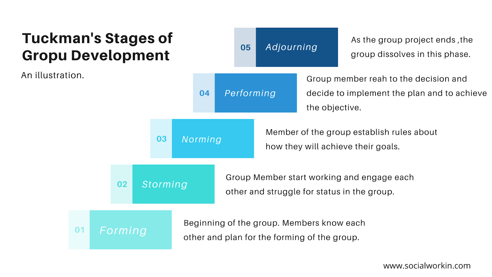

- # Part 1 - Introduction
  collapsed:: true
	- Psychology
		- A scientific study of human behavior and mental processes
		- Etymologically, it came from the Greek words, Psyche which means `soul` or `mind`, and Logos which means `the study of`.
	- Behavior
		- Any response or activity of an organism
		- It can either be simple or complex; overt or covert; conscious or unconscious; voluntary or involuntary; rational or irrational
	- Tabula rasa by `John Locke`
		- Believed that at birth the human mind is a `tabula rasa` or a blank slate, on which experience “writes” knowledge.
	- Theory of Evolution
		- Charles Darwin
	- Father of Mental tests
		- Francis Galton
	- Father of Modern Psychology
		- Wilhelm Wundt
	- Structuralism
		- Structuralism is the approach of psychology which emphasis on the study of components of consciousness
	- Functionalism
		- Rather than focusing on the elements of consciousness, functionalists focused on the purpose of consciousness and behavior.
	- Introspection
		- is the examination of one's own conscious thoughts and feelings
	- Examples of types of 5 behaviors.
		- simple or complex
		- overt or covert
		- conscious or unconscious
		- voluntary or involuntary
		- rational or irrational
- # Part 2 - Types and Scope
  collapsed:: true
	- Classical Conditioning `Ivan Pavlov`
		- The typical procedure for inducing classical conditioning involves presentations of a neutral stimulus along with a stimulus of some significance.
		- The neutral stimulus could be any event that does not result in an overt behavioral response from the organism under investigation. Pavlov referred to this as a Conditioned Stimulus (CS).
	- Operant conditioning `B F Skinner`
		- Operant conditioning can be defined as a type of learning in which voluntary (controllable; non-reflexive) behavior is strengthened if it is reinforced and weakened if it is punished (or not reinforced).
	- Psychodynamic approach `Sigmund Freud`
		- The approach based on the belief that behavior is motivated by unconscious inner forces over which the individual has little control.
		- Key features of the Psychodynamic approach are:
			- Our behavior and feelings as adults are rooted in our childhood experiences.
			  Relationships (particularly parenting) are of primary importance in determining how we feel and behave.
			- Our behavior and feelings are powerfully affected by the meaning of events to the unconscious mind.  Information can be obtained from dreams, irrational behavior and what patients in therapy say.
			- The personality is made up of three distinct structures: id, ego and super ego.
			  Defense mechanisms are used to protect the ego, e.g. repression.
			- Children develop through a series of fixed stages: oral, anal and phallic.
	- Five Stages of growth and development:
		- Oral
			- Zone: Mouth
			- Primary Interaction: Mouth
			- Age: 0 - 1 years
			- Derive pleasure from oral stimulation such as eating, tasting and sucking
			- Problems
				- Drinking
				- Smoking
				- Nail Biting
		- Anal
			- Zone: Bowel and bladder
			- Age: 1 - 3 Years
			- Primary Focus: Controlling Bowel and Bladder Movements
			- The child has to learn its body needs
			- Problems
				- if learnt can cause destructive, wasteful and messy personality.
				- strictness can cause orderly, rigid and obsessive personality.
		- Phallic
			- Age: 3 - 6 years
			- Zone: Genitals
			- Primary Focus: Genitals
			- Child became to discover differences of males and females.
			- Affection with opposite sex parents
		- Latent
			- Age: 6 to puberty
			- Zone: Sexual feelings are inactive
			- Super ego and ego continuous to develop and id is suppressed
			- development of social skills, values and relationships
			- Problems:
				- if stuck or fixated in this phase, results in immaturity and inability to form relationships
		- Genital
			- Age: puberty to death
			- Zone: Maturing Sexual Interest
			- Puberty causes libido to become active once again
			- Strong sexual interest in opposite sex
			- Goal - establish balance in different phases of life
	- Gestalt `Max Wertheimer`
		- Gestalt is a German word that means roughly means “shape”, “form”, “essence”, or “whole”.
		  Gestalt is a psychology term which means "unified whole".
		- It refers to theories of visual perception developed by German psychologists in the 1920s
		  One of the most important theories of perception is the Gestalt Theory.
		- “The Whole is different from the sum of its part”.
	- Humanistic psychology
		- Humanistic psychology emphasizes looking at the whole individual and stresses concepts such as free will, self-efficacy, and self-actualization.  Rather than concentrating on dysfunction, humanistic psychology strives to help people fulfill their potential and maximize their well-being.
	- Cognitive psychology
		- Studies mental processes including how people think, perceive, remember and learn. As part of the larger field of cognitive science, this branch of psychology is related to other disciplines including neuroscience, philosophy, and linguistics.
	- Fields of psychology
		- Experimental Psychology
		- Biopsychology
		- Developmental Psychology
		- Social Psychology
		- Industrial / Organizational Psychologists
		- Educational Psychologists
		- Clinical Psychology
		- Counseling Psychology
		- Cross-cultural psychology
		- Forensic Psychology
		- Environmental psychology
		- Psychiatry
- # Part 3 - Motivation
  collapsed:: true
	- Motivation
		- Motivation is the set of reasons that determines one to engage in a particular behavior.
		- The psychological feature that arouses an organism to action toward a desired goal; the reason for the action; that which gives purpose and direction to behavior.
		- Types:
			- Intrinsic Motivation
				- An internal stimulus that arouses one to action. It is based on  motive, which is always intrinsic. A  motive arouses one to do something.
			- Extrinsic Motivation
				- An external stimulus to  action. This type of motivation is based on incentive. This type of  motivation comes from the outside of  the individual, that is, from the  external environment.
		- Importance
			- Directs activities towards the  achievement of a goal.
			- Controls and directs human  behavior.
			- Inculcates spiritual and  moral values in the minds of  the young.
			- Gives satisfaction and  happiness to the individual.
		- Processes
			- Need --Motive/Drive--> Actions -> satisfaction
	- Incentive
		- An external benefit or reward of  some kind derived from an activity.
		- May come in the form of social  approval as praise, good grades,  honors, scholarships, medals, and 
		  the like.
	- Maslow's Hierarchy
		- Physiological
			- These refer to basic physical needs, such as drinking when thirsty or eating when hungry. According to Maslow, some of these needs involve our efforts to meet the body’s need for homeostasis; that is, maintaining consistent levels in different bodily systems. For example, food.
		- Safety
			- Once people’s physiological requirements are met, the next need that arises is a safe environment. Our safety needs are apparent even early in childhood, as children have a need for safe and predictable environments and typically react with fear or anxiety when these needs are not met. For example, shelter.
		- Love and Belonging
			- According to Maslow, the next need in the hierarchy involves feeling loved and accepted. This need includes both romantic relationships as well as ties to friends and family members. It also includes our need to feel that we belong to a social group. For example, relationships.
		- Esteem
			- Our esteem needs involve the desire to feel good about ourselves. According to Maslow, esteem needs include two components. The first involves feeling self-confidence and feeling good about oneself. When people’s esteem needs are met, they feel confident and see their contributions and achievements as valuable and important.
		- Self-Actualization
			- Self-actualization refers to feeling fulfilled, or feeling that we are living up to our potential. One unique feature of self-actualization is that it looks different for everyone. For one person, self-actualization might involve helping others.
	- Biological Motives
		- Oxygen
		- Hunger
		- Thirst
		- Sex
		- Avoidance of Pain
		- Temperature regulation
		- Bladder tension
		- Fatigue
	- Social Motives
		- Refers to an individual's desire for significant accomplishment, mastering of skills, control, or high standards.
- # Part 4 - Compliance and Obedience
  collapsed:: true
	- Compliance
		- Compliance is the act or process of complying to another person’s desire, demand or proposal.
		- Techniques used to gain compliance
			- The `Door-in-the-Face` Technique: In this approach, marketers start by asking for a large commitment. When the other person refuses, they then make a smaller and more reasonable request.
			- The `Foot-in-the-Door` Technique: In this approach, marketers start by asking for and obtaining a small commitment. Once you have already complied with the first request, you are more likely to also comply with a second, larger request
		- Example
			- when an individual performed a task when asked to, this individual is complying with a request. The unwritten law of the group and members is to stick to the rules in order to be considered as being part of the group, this is considered the most important characteristic of compliance.
	- Obedience
		- Obedience, in human behavior, is a form of social influence in which a person yields to explicit instructions or orders from an authority figure“.
		- People don’t want to be rude or offend the authority.
		- Example:
			- In schools, many teachers find that their absence from the classroom instantly causes a eruption of noise – caused by the pupils. This is because from a young age we have been brought up viewing teachers as a legitimate authority figure – and in the majority of cases we will obey them. However when the physical absence of the teacher is apparent the ‘unspoken’ rules (for example, no talking) are dismissed.
		- Importance
			- In everyday situations, people obey orders because they want to get rewards, because they want to avoid the negative consequences of  at disobeying, and because they believe an authority is legitimate. In more extreme situations, people obey even when they are required to violate their own values or commit crimes. i.e obedience of God, Parents , Teachers , etc.
	- Conformity
		- Conformity is the most common and pervasive form of social influence. It is informally defined as the tendency to act or think like members of a group.
		- In psychology, conformity is defined as the act of matching attitudes, beliefs, and behaviors to group norms
		- Importance
			- A compliance program is a formal system to help in maintaining compliance in all areas of operation. The program will  at focus on upholding policies and procedures that prevent others to breaking laws and regulations. i.e compliance in banks, corporate jobs, etc.
	- Differences
		- Obedience involves an order; conformity involves a
		  request.
		- Obedience involves following the order of someone
		  with a higher status; conformity usually involves
		  going along with people of equal status.
		- Obedience relies on social power; conformity relies
		  on the need to be socially accepted.
	- The Migram Experiment
		- Milgram (1963) was interested in researching how far people would go in obeying an instruction if it involved harming another person.
		- Stanley Milgram was interested in how easily ordinary people could be influenced into committing atrocities, for example, Germans in WWII.
		- Results
			- 65% (two-thirds) of participants (i.e., teachers) continued to the highest level of 450 volts. All the participants continued to 300 volts.
			- Milgram did more than one experiment – he carried out 18 variations of his study. All he did was alter the situation (IV) to see how this affected obedience (DV).
		- Conclusion
			- Ordinary people are likely to follow orders given by an authority figure, even to the extent of killing an innocent human being. Obedience to authority is ingrained in us all from the way we are brought up. People tend to obey orders from other people if they recognize their authority as morally right and/or legally based. This response to legitimate authority is learned in a variety of situations, for example in the family, school, and workplace.
- # Part 5 - Group
  collapsed:: true
	- Group
		- Two or more individuals
		- Who interact with one another
		- Are interdependent upon one another
		- Aware of belonging to a group
		- Purpose
		  collapsed:: true
			- Time efficiency
			- Effective use of resources
			- Social opportunities
			- Better decisions and outcomes
			- Peer support.
		- Types
		  collapsed:: true
			- Formal
			- Informal
		- Characteristics
		  collapsed:: true
			- Size
			- Goals
			- Norms
			- Structure
			- Roles
			- Interaction
			- Collective Identity
		- Composition
		  collapsed:: true
			- homogenous groups: qualities in common
			- heterogeneous groups: few qualities in common
		- Size
		  collapsed:: true
			- Small groups: good communication, satisfaction
			- Large groups: can specialize; coordination, communication problems
		- Roles
		  collapsed:: true
			- Every member of a group has certain roles and responsibilities, which are assigned, by the group leader (which is also a role)
			- The Leader
			  collapsed:: true
				- Before you begin any project, have an established leader. This person is responsible for mediating conflicts, facilitating communications between team members, and keeping everyone on course.
			- The Team player
			  collapsed:: true
				- A member of a group who tries to do what is good for the group rather than what is good for just himself or herself. They’re usually
					- Eager to help
					- Willing to compromise
					- Diplomatic
			- The Researcher
			  collapsed:: true
				- If you need more information to complete your project, it’s important to have a strong researcher who can get it for you.
				- Their special talent:
					- Researchers ask the overlooked questions.
					- Knows the quickest way to the best resources.
					- “Go to” person for the most puzzling questions.
			- The Expert
			  collapsed:: true
				- This is the person that possesses intimate knowledge in a field that your project encompasses.
			- The Creative one
			  collapsed:: true
				- Someone who can deliver fresh ideas and solutions that let the team’s work stand out from the crowd.
				- Creative types have a tendency to get caught up in their world of imagination, problem solving, and conceptualizing.
			- The Communicator
			  collapsed:: true
				- Individuals who are naturally inclined to reach out to others and share information with the entire team.
				- Communicators are often thought of as the salespeople, marketers, writers and leaders.
	- Stages of Group Development
	  collapsed:: true
		- 
		- `Forming`: At this stage, the formation of a new group begins, wherein the members come together and get to know each other through the interactions.
		- `Storming`: Once the forming stage is over, the individuals will start interacting with each other in the context of the task to be achieved.
		- `Norming`: Here, everybody works cohesively towards the target and appreciate each other’s experience and skills.
		- `Performing`: At this stage, synergy gets created between the team members, where everyone works towards the accomplishment of a goal. This stage is characterized by flexibility and interdependence. 
		  `Adjourning`: This is the last stage of group development, where the group is terminated, and the group members are separated from each other. Every group is created for a purpose, and once the purpose is fulfilled the group is adjourned.
	- Group Influence
		- Groups influence individual decision-making processes in a variety of ways, such as:
			- Groupthink
			  collapsed:: true
				- A psychological phenomenon that occurs within groups of people, in which the desire for harmony in a decision-making group overrides a realistic appraisal of alternatives.
				- “Go with the flow”
			- Groupshift
			  collapsed:: true
				- Groupshift is the phenomenon in which the initial positions of individual members of a group are exaggerated toward a more extreme position.
				- When people are in groups, they assess risk differently than they do when they are alone. In the group, they are likely to make riskier decisions as the shared risk makes the individual risk seem to be less.
			- Deindividuation.
			  collapsed:: true
				- Individuals’ loss of self-awareness when in a group.
				- Larger the group, higher the incidence of deindividuation.
				- People tend to do things, that without the group for support, they would not normally do (even criminal activities)
		- Group polarization
		  collapsed:: true
			- Group polarization is the tendency to shift toward more extreme positions after group discussion
		- Group Productivity
		  collapsed:: true
			- Depends upon:
				- Type of task
				  collapsed:: true
					- `Additive tasks` - the contributions of each member are combined into a single group product.
					- `Conjunctive tasks` - the groups final product is determined by its poorest performing member (the weakest link in the chain).
					- `Disjunctive tasks` - the groups final product is determined by the best or most competent person in the group.
					- `Compensatory tasks` - the contributions of various members a averaged together to form a single group outcome.
				- Social Loafing
				  collapsed:: true
					- Social loafing refers to the concept that people are prone to exert less effort on a task if they are in a group versus when they work alone.
					- The Ringelmann effect
						- In 1913, a guy named Max Ringelmann, a French agricultural engineer, took a rope and asked individual people to pull on it.
						- Then he asked those same people to pull on the rope with a group. He observed that when people pulled with a group, they put in less effort than when pulling on their own.
						- This was an experiment on the concept of Social Loafing.
		- Social Facilitation
		  collapsed:: true
			- Social facilitation The tendency for people to perform simple or well-learned tasks better when others are present. The strengthening of dominant (prevalent) responses in the presence of others. D. Myers
			- Norman Triplett (1898) found that cyclists times were faster when racing with others than when they were racing alone. So he conducted an experiment in which he asked children to wind fishing reels as quickly as they could. He found that children who worked alongside a competitor, wound the reel faster.
	- Benefits of Group
	  collapsed:: true
		- Group members benefit greatly from sharing challenges and ideas.
- # Part 6 - Leadership
  collapsed:: true
	- Leadership is influencing people - by providing purpose, direction, and motivation - while operating to accomplish the mission and improving the organization.
	- Leadership  is the ability to influence a group towards the achievement of vision or set of goals
	- "The leader is someone who has followers" - `Peter Drucker`
	- "As we look ahead into the century, leader will be those who empower others" - `Bill Gates`
	- Boss vs Leader
		- | Boss | Leader |
		  | :--- | :--- |
		  | A boss drives employees. | A leader coaches employees. |
		  | Follow orders because of their authority. | Follow them because of their good will. |
		  | They develop the feeling of fear. | They generate enthusiasm. |
		  | They says”I”. | They says “WE.” |
		  | Places blame for breakdown. | Fixes the breakdown. |
		  | Knows how its done. | Shows how it is done. |
		  | Bosses uses people. | Leaders develop people. |
		  | They takes all the credit. | They give credit. |
		  | They commands. | They ask. |
		  | Bosses says “Go” | Leaders says “LET’S GO” |
	- Theories of leadership
		- Trait Theory
			- Successor of "Great Man" Theory of leadership
			- Trait theories of leadership focus on personal qualities and characteristics
			- Attempt to discover the traits shared by all effective leaders
			- Traits are enduring attributes associated with an individual's personality or makeup
		- Behavioral Theory
			- Behavioral leadership theories (derived from Ohio State and University Of Michigan Studies) focus on common behaviors common to effective leaders
			- The Ohio State leadership studies identified two important leader behaviors
				- Initiating Structure (defining, organizing, structuring the work situation)
				- Consideration (showing concern for feelings and needs of followers)
			- University Of Michigan Studies also identifies two important leadership behaviors
				- Relationship Oriented Behaviors (Leader Behavior focused on interpersonal relationship on the job)
				- Task Oriented Behaviors (Leader Behaviors focused on work task)
		- Contingencies Theory
			- Fiedler's contingency model maintains that effective leadership depends on match between the leader's style and the degree to which the work situation gives control and influence to the leader
			- According to Fiedler ,leader may be primarily task oriented or relationship oriented
			- In Fiedler's model ,to assess the work situation ,three situation are examined
				- Leader-member relations (relationship between leader and followers)
				- Task Structure (how well elements of the work task are structured)
				- Position Power (authority to punish or reward)
	- Traits of Leader
		- “A leader is one who knows the way, goes the way, and shows the way.”
		- 8 Traits
			- Honesty & Integrity
				- Leaders succeed when they stick to their values and core beliefs and without ethics, this will not be possible.
			- Innovation
				- “Innovation distinguishes between a leader and a follower.”
			- Empathy
				- Understanding the problems of your followers and feeling their pain is the first step to become an effective leader.
			- Accountability
				- “A good leader takes little more than his share of the blame and little less than his share of the credit.”
			- Good Communicator
				- A good communicator can be a good leader. Words have the power to motivate people and make them do the unthinkable.
			- Inspire others
				- “If your actions inspire others to dream more, learn more, do more and become more, you are a leader.”
			- Delegation & Empowerment
				- Delegate tasks to your subordinates and see how they perform. Provide them with all the resources and support they need to achieve the objective and give them a chance to bear the responsibility.
			- Confidence
				- To be an effective leader, you should be confident enough to ensure that other follow your commands..
	- Traits shared by all leaders
		- Willingness to stand out, differentiate yourself, risk rejection by being different, a dose of rebelliousness.
		- Determination and perseverance to push through your own ideas.
		- Improvement drive - desire to find better ways of doing things, curiosity.
		- Questioning mind - not accepting authority, willingness to challenge the status quo.
		- Self belief - believing that you can think for yourself and devise a better way.
		- Thick skin - being able to withstand criticism and recover from setbacks.
		- Learning from m\
		- istakes - being prepared to try things to find what works.
	- Lewin's leadership styles
		- Autocratic
			- In the autocratic style, the leader takes decisions without consulting with others.
		- Democratic
			- In the democratic style, the leader involves the people in the decision-making, although the process for the final decision may vary from the leader having the final say to them facilitating consensus in the group.
	- Types of Leadership
		- Authoritarian Leadership(autocratic leaders)
			- The autocrat gives orders and expects prompt execution, with little-to-no feedback or input from the worker. This leadership style can work in a production-type environment that demands maximal output in simple, repetitive job roles. It rarely allows for an environment in which creativity will flourish. The autocrat pushes employees hard; often, he does not get loyalty and long-term commitments in return. High turnover and low satisfaction is expected, in response to this leadership style. There are times when autocratic leadership is effective
		- Participative Leadership (Democratic)
			- this is generally the most effective leadership style. Democratic leaders offer guidance to group members, but they also participate in the group and allow input from other group members.
		- Delegative (Laissez-Faire) Leadership
			- Researchers found that children under delegative leadership were the least productive . The children in this group also made more demands on the leader, showed little cooperation and were unable to work independently. Delegative leaders offer little or no guidance to group members and leave decision-making up to group members. While this style can be effective in situations where group members are highly qualified in an area of expertise, it often leads to poorly defined roles and a lack of motivation.
		- Transactional Leadership
			- Transactional leadership relies more about "trades" between the leader and follower by which followers are compensated for meeting specific goals or performance criteria . The transactional leader will first validate the relationship between performance and reward and then exchange it for an appropriate response that encourages subordinates to improve performance . Transactional leadership in organizations plays an exchange role between managers and subordinates. Transactional leadership style is understood to be the exchange of rewards and targets between employees and management .
		- Transformational Leadership
			- leadership approach that causes change in individuals and social systems. In its ideal form, it creates valuable and positive change in the followers with the end goal of developing followers into leaders.
			- There are four main components of transformational leadership:
				- 1. Individualized consideration
				- 2. Intellectual stimulation
				- 3. Inspirational Motivation
				- 4. Idealized Influence.
			- Each of these components are positively related to individual and organizational performance.
	- Characteristics of Leadership
		- Authenticity
		- Desire to Serve Others
		- Empowering People Guided by Heart, passion and compassion
		- Recognize their shortcomings
		- Lead with Purpose
		- Build Enduring Relationships
		- Clear Where They Stand
		- Refuse to Compromise
		- Develop Themselves
	- Principles of Leadership
		- Know yourself and seek self-improvement
		- Be technically proficient
		- Seek responsibility and take responsibility for your actions
		- Make sound and timely decisions
		- Set the example
		- Know your people and look out for their well-being
		- Keep your workers informed
		- Develop a sense of responsibility in your workers
		- Ensure that tasks are understood, supervised, and accomplished
		- Train as a team
		- Use the full capabilities of your organization
	- Function of leadership
		- HOW TO IMPACT AND INFLUENCE TO BRING CHANGES
		- Implementation of Change and Effects
		- Preparing for the change and Reducing Negative effects
		- The leader is the key player in decision-making
	- Duties of the leader
		- Establish the Rules
		- Enforce the Rules
		- Maintain Social Order
		- Theories: Great person theory
		- Situational theories
	- Effects of bad leadership
		- Lack of Motivation
			- One basic type of leader is the so called "buddy" who focus on being nice to employees. Such leaders avoid confrontations and disregard negative issue.
		- Lack of team performance
			- Leaders can’t get very far on their own. They need to adopt management practices that allow team members to put their talents to use, feel like their efforts are important
		- Resource Mismanagement
			- Poor leadership skills not only have an effect on employees' performance, but also on the administration's own tasks. Managing resources, keeping a record of the organization's income and expenses,
		- Lack of collaborative environment
			- To create a cooperative work environment, leaders need strong interpersonal skills that allow them to build bridges, maintain useful connections within their network, share information and resolve disputes.
		- Moral  Drop
			- Members of the organization nor prove their abilities through rational and accurate administration can be the reason of low morale between individuals. Low morale can subsequently lead to a lack of discipline and will for employees
- # Part 7 - Intelligence
  collapsed:: true
	- Intelligence is an inferred process that humans use to explain the different degrees of adaptive success in people’s behavior.
	- The capacity to understand the world, think rationally, and use resources effectively when faced with challenges.
	  collapsed:: true
		- The ability to understand and deal with people, objects, and symbols
		- The ability to act purposefully, think rationally, and deal effectively with the environment
	- Mental Age
	  collapsed:: true
		- Binet and Simon used Mental age to  distinguish “bright” from “dull” children
		- Mental age is a concept related to intelligence. It looks at how a specific individual (usually a child), at a specific age, performs intellectually, compared to average intellectual performance for that individual's actual chronological age (i.e. time elapsed since birth).
	- Chronological age
	  collapsed:: true
		- Chronological age is a measure of an individual's age based on the calendar date on which he or she was born
	- What is IQ?
	  collapsed:: true
		- Performance was described as an intelligence quotient (IQ) which was imply the ratio of mental age to chronological age multiplied by 100:
		- IQ=MA/CA x 100
	- Emotional Intelligence
	  collapsed:: true
		- EQ (Emotional Intelligence): Some psychologists broaden the concept of intelligence even further beyond the intellectual realm to include emotions. (EQ)
		- Emotional intelligence is the set of skills that underlie the accurate assessment, evaluation, expression, and regulation of emotions.
		- Emotional intelligence is the ability to understand their own emotions,  the emotions of others, and to act  appropriately using these emotions.
		- Emotional intelligence never stops growing. Because we are always evolving as people, EQ is something that must be nurtured.
		- points:
			- Self Awareness
			  collapsed:: true
				- Recognize internal feelings
				- Recognize how someone is feeling, without them having to say anything.
				- Using your gut feeling to guide decisions.
			- Managing emotions
			  collapsed:: true
				- Finding ways to  handle emotions that are appropriate to the situations
			- Motivation
			  collapsed:: true
				- Using self control to channel emotions towards a goal
			- Empathy
			  collapsed:: true
				- Understanding the emotional perspective of other person
			- Handling Relationships
			  collapsed:: true
				- Using personal information and information of others to handle social relationships and to develop interpersonal skills
	- IQ vs EQ
	  collapsed:: true
		- IQ
			- Measure	of	an	individual’s	personal  information bank
			- Memory, vocabulary and visual motor skills
			- IQ is set and peaks at age 17
			- Remains constant through adulthood
			- Established by mid-teens
			- Can’t increase
			- Predicts only 10% – 20% of life success
		- EQ
			- Not fixed
			- Can be improved throughout life
		- 90% of the success of outstanding  leaders is attributable to emotional  intelligence (EQ), which is twice as  important than intellectual intelligence  (IQ).
		- EI is the strongest predictor of workplace performance.
		- 90% of top performers have high emotional intelligence.
		- People with average IQs outperform those with the highest IQs 70% of the time.
		- Decades of research now point to EI as being the critical factor that sets star performers apart from the rest of the pack
	- What are emotions
	  collapsed:: true
		- An Emotion is a natural instinctive state of mind deriving from one’s circumstances, mood or relationship with others.
		- Two types of Emotions:
		  collapsed:: true
			- Positive Emotions
			  collapsed:: true
				- Love
				- Appreciation
				- Happiness
				- Hope
				- Confidence
				- Patient
				- Trust
				- Vulnerable
			- Negative Emotions
			  collapsed:: true
				- Fear
				- Anger
				- Guilt
				- Depression
				- Jealousy
				- Anxiety
				- Shame
				- Regret
				- Worried
				- Sad
	- Experiencing Emotions
	  collapsed:: true
		- Emotional experiences have three components
		  collapsed:: true
			- Subjective feelings
			- Expressive behavior
			- Physiological responses
	- Subjective feeling
	  collapsed:: true
		- That is how the individual interprets what they are feeling at any point.
		- These are inner personal experiences. Subjective feelings in response to an emotion cannot be readily observed.
		- We also don't always experience pure forms of each emotion. Mixed emotions over different events or situations in our lives are common.
		- When faced with starting a new job you might feel both excited and nervous.
		- Getting married or having a child might be marked by a wide variety of emotions ranging from joy to anxiety. These emotions might occur simultaneously, or you might feel them one after another.
	- Physiological responses
	  collapsed:: true
		- This involves bodily changes which occur when we experience an emotion. This involves the operation of the brain as well as the Autonomic Nervous System and it also involves the cells in our body.
		- It is often our awareness of the arousal that makes us suddenly aware that we are experiencing an emotion.
	- Expressive behavior
	  collapsed:: true
		- This refers to the outward signs that an emotion is being experienced.
		- Such behavior can be intentional or Unintentional and includes
		- facial expressions as well as body language.
	- Factors Influencing Emotions
	  collapsed:: true
		- Personality
		- Weather
		- Stress
		- Social activities
		- Sleep
		- Exercise
		- Age
		- Gender
		- Health
	- Components of Emotional quotient
	  collapsed:: true
		- `Intrapersonal`	–	Self-regard,	emotional	self  awareness, independence, self-actualization.
		- `Interpersonal`- Empathy, Social responsibility and interpersonal relationships
		- `Adaptability`- reality testing, flexibility, problem solving
		- `Stress management`- stress tolerance, impulse control
		- `General mood`- optimism, happiness
	- Characteristics of emotionally intelligent people
	  collapsed:: true
		- Knowing one’s feelings
		- Managing emotions & feelings appropriately
		- Able to motivate self
		- Ability to persist in face of frustrations
		- Ability to control impulses & delay gratification
		- Ability to empathize with others
		- Capacity to HOPE
		- Social competencies
	- How to increase EQ
	  collapsed:: true
		- Conduct a “personal inventory.”
		- Analyze the setting & identify skills needed.
		- Enlist trusted friends.
		- Focus on a few competencies.
		- Practice, practice, practice.
		- Be observant and reflective.
		- Don’t expect immediate results.
		- Learn from your mistakes.
		- Acknowledge your successes.
	- EQ values
	  collapsed:: true
		- Creativity
		- Stress Management
		- Decision Making
		- Relationship Building
		- Can be enhanced
		- What else is important to you?
	- How to develop a higher sense of emotional intelligence
	  collapsed:: true
		- Become emotionally literate; Label your  feelings, rather than labeling people or  situations. ( Say “I feel” instead of “I know”)
		- Distinguish between thoughts and feelings.
		- Take more responsibility for your feelings.
		- Use your feelings to help make decisions
		- Use feelings to set and achieve goals
		- Be aware of how situations impact your thoughts, feelings and physical reactions and how these may influence your behaviours.
		- Listen to verbal cues and observe non-verbal cues of others
		- Use “I” statements not “you” statements
		- STOPP (stop, take breath, observe, pull back, practice/proceed)
		- Don’t immediately believe all of your thoughts-challenge them!
		- Do regular self-care activities
		- Feel energized, not angry.
		- Validate other people's feelings.
		- Use feelings to help show respect  for others.
		- Don't advise, command, control,  criticize, judge or lecture to others.
		- Avoid people who invalidate  you.
	- Some IQ Test Questions
	  collapsed:: true
		- Water lilies double in area every 24 hours.  At the beginning of the summer, there is one water lily on a lake.  It takes 60 days for the lake to become covered with water lilies.  On what day is the lake half-covered?
		- A farmer has 17 sheep.  All but 9 break through a hole in the fence and wander away.  How many are left?
- # Part 8 - Coping
  collapsed:: true
	- 4 major coping strategies of stress
		- Behavioral
			- Eating, drinking, sleeping patterns in control.
			- Distract yourself from the situation.
			- Walk, Exercise, Meditate.
		- Cognitive
			- restructure thoughts
			- be positive
			- gratitude
		- Emotional
			- identify and ventilate
				- talking to friend
				- writing journal
				- writing letter (sending is optional)
		- Spiritual / Religious
- # Part 9 - Personality
  collapsed:: true
	- Personality has been derived from the Latin word `persona` which means `mask` used by the actors to change their appearance. It is the combination of an individual thoughts, characteristics, behaviors, attitude, idea and habits.
	- As a professional term in psychology, personality is a person's unique patterns of thought, emotion, and behavior. This means that personality is all the characteristics of who we are as unique individuals.
	- When psychologists study personality, they usually conduct two different kinds of research.
		- How and why people differ in a particular characteristic or group of characteristics like humor, being outgoing, aggression, and more.
		- How the different traits in a person's personality work together to create who they are and how they interact with the world around them.
	- The `ideographic view` of personality sees each person as completely unique individuals. People cannot be compared with one another because their psychological makeups are integrated wholes and not a series of comparable characteristics.
	- This contrasts the `nomothetic view` that states that personality traits can be compared between people and where each person places on a scale of that trait. Their unique personality is thus observed by mapping their position along these traits.
	- Types
		- Extrovert
			- This type has the tendency to live mostly outside the like to live with others. Those individuals are highly socialized and have contact with outside people in the society. They want to join other groups who are more in number.
		- Introvert
			- Introvert is opposite to extrovert. Those people are always live alone in their rooms and do not want to go outside. They have their own imaginary world. They are teachers, scientists, thinkers and philosophers.
		- Ambivert
			- Between extrovert and introvert personalities there is a third one type called ambivert. People belonging to this type enjoy both the groups and attend them. They have middle mind and want to live in both parties.  Sometimes they join outside people but sometimes they live in their own rooms.
	- Development Tips
	  collapsed:: true
		- Should be a better listener
		- Good conversation
		- Be positive in outlook and attitude
		- More reading and building interest
		- Should be a good courteous
		- Interaction with new people
		- Helpful to other people
		- Give respect if you want respect
		- Confident about yourself
	- Personality Traits
		- Openness to experience
			- Openness is shorthand for "openness to experience." People who are high in openness enjoy adventure. They're curious and appreciate art, imagination and new things. The motto of the open individual might be "Variety is the spice of life."
		- Conscientiousness
			- People who are conscientious are organized and have a strong sense of duty. They're dependable, disciplined and achievement-focused. You won't find conscientious types jetting off on round-the-world journeys with only a backpack; they're planners.
		- Extraversion
			- Extraversion versus introversion is possibly the most recognizable personality trait of the Big Five. The more of an extravert someone is, the more of a social butterfly they are. Extraverts are chatty, sociable and draw energy from crowds. They tend to be assertive and cheerful in their social interactions.
		- Agreeableness
			- Agreeableness measures the extent of a person's warmth and kindness. The more agreeable someone is, the more likely they are to be trusting, helpful and compassionate. Disagreeable people are cold and suspicious of others, and they're less likely to cooperate.
		- Neuroticism
			- They worries about everything, obsesses over germs and disease and once quits a job because his anxiety over not having access to a private bathroom is too overwhelming. People high in neuroticism worry frequently and easily slip into anxiety and depression.
	- Can Personality Change ?
		- Maybe. A study published in the January 2017 published research papers and found that personality may be altered through therapy. "For the people who want to change their spouse tomorrow, which a lot of people want to do, I don't hold out much hope for them," said study researcher Brent Roberts, a social and personality psychologist at the University of Illinois. However, he continued, "if you're willing to focus on one aspect of yourself, and you're willing to go at it systematically, there's now increased optimism that you can affect change in that domain."
	- Type A
		- The `Type A` personality generally lives at a higher  stress level. This is driven by
		  collapsed:: true
			- Ambitious
			- Rigidly organized
			- Highly status-conscious
			- Sensitive
			- Impatient
			- Take more than they can handle
			- Want other people to get to the point
			- Proactive
			- Concerned with time management
		- Problems faced by Type A  personality
		  collapsed:: true
			- Free-floating hostility
			- Time urgency and impatience
			- A competitive drive
		- Type A Personality Health  Risks
		  collapsed:: true
			- Greater rate of cardiovascular disease
			- Greater rate of heart attacks
			- Increased risk for premature death from all causes
			- Not gender-specific
	- Type B
		- The Type B personality generally lives at a lower stress  level and are typically:
			- Stress Handling
			- Lack Of Urgency
			- Relaxed
			- Less Competitive
			- Patient
			- Non-aggressive
			- Socializing And Enjoying
		- Effect of having type B  personality
			- Healthy life
			- you’re a better friend
			- you take the long view
			- you do well with risk and failure
			- you see good in people
			- creativity flows from you
			- you know how to enjoy that moment